# Jamat

**Just Another Multi-Agent Terminal** — an open-source desktop control center for running many
[Claude Code](https://www.anthropic.com/claude-code) sessions in one tiling workspace, and for
reaching the sessions running on your other computers across the network — including letting one
AI agent operate another's tab.

> **Status:** Early WIP — **Windows + Claude Code today** (macOS/Linux and more agents soon). A
> spare-time personal project, open-sourced in case it's useful. No company, no promises beyond "soon".

[](LICENSE)
[](https://github.com/ludekvodicka/jamat/actions)
[](#quick-start)
[](https://nodejs.org)

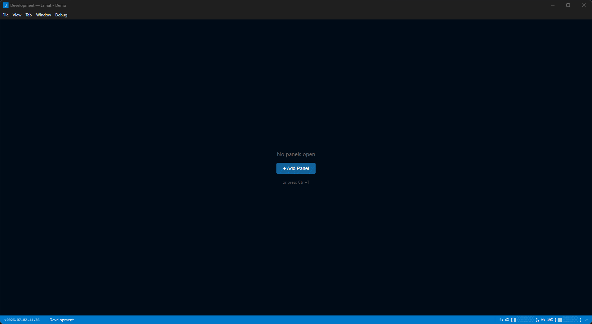

---

## What it does

You're running Claude Code in five tabs — and another two on the PC in the next room. Jamat puts
every session in one tiling workspace, shows you which agent is **working** and which is **waiting
on you**, and lets you reach (or hand work to) the agents on your **other machines**. Open source,
self-hosted, your keys — nothing is proxied.

**Day to day:**

- **Quick project & session selector** — a command palette lists your projects and each project's
  recent sessions; resume the exact session by name or open a new tab, no hunting for `--resume` IDs.
- **Easy compaction** — when context fills up, a one-click **Compact now** nudge runs `/compact` at
  thresholds you set (also on the status bar and the tab menu).
- **Predefined messages** — reply to a finished agent in one click: "Continue", "Summarize", or your
  own quick prompts, typed & sent for you.
- **Detailed Claude stats** — a usage dashboard breaks cost & tokens down by project and model
  (input / output / cache), across 1h / 5h / 24h windows.

…plus cross-machine control, AI-operates-AI, phone access, and skill/MCP management — see
**Highlights** below.

## Why Jamat?

Plain terminal tabs, a VS Code window, or a session multiplexer each solve part of this — Jamat is
the combination, aimed specifically at _many_ Claude Code agents:

- **vs. terminal tabs / tmux** — tabs don't tell you which agent is _working_ vs _waiting on you_, or
  survive a reboot with the layout intact. Jamat does both, and adds diffs, usage stats and a session
  picker on top.
- **vs. an IDE** — an editor runs one integrated assistant in one window. Jamat is built for running
  and _watching many_ agents at once — and for the non-code "a folder per topic" workflow too.
- **vs. single-machine session managers** (claude-squad, Crystal, Conductor) — those orchestrate
  sessions on one box. Jamat reaches **across machines** on your LAN, and lets **one agent operate
  another's tab**.

## Not just for code — a workspace per topic

You don't have to use Jamat for programming. Every "project" is just a **folder**, so you can give
each thing in your life its own — _garden_, _pool_, _house renovation_, _taxes_ — and Jamat turns
each into an entry in the selector.

Instead of one long, forgetful chat, you get a **persistent, topic-scoped conversation**:

- **Pick a topic and continue where you left off** — the project & session selector opens the right
  folder and resumes its conversation by name; the AI already has the whole history, no re-explaining.
- **Drop in documents** — put PDFs, notes, quotes, or photos in the folder (renovation invoices, the
  pool-pump manual); the agent reads them as part of that topic's context.
- **It remembers** — each folder keeps its own session history and notes, so last month's discussion
  is still there the next time you open it.
- **Everything stays local** — the folders and their history live on your disk, on your own keys.

Jamat is then as much a **filing cabinet of ongoing AI conversations** as a developer tool — one
drawer per subject, each with full memory and its own documents.

## Highlights

- **Every session in one window** — tiling, dockable, multi-window / multi-tab workspace with full
  position / size / layout persistence, named & colored windows, and per-directory project selection.
- **Never lose an agent** — live per-tab **working / waiting-on-you / completed** detection, so at a
  glance you always know which tab is busy and which one is waiting on you.
- **See exactly what changed** — diffs **by git/SVN history, by session, or by individual message**;
  file / changes / directory viewers; session search across all projects; commit helpers (never
  auto-commits).
- **Jump from output to source** — right-click any file path mentioned in a session's output to open
  it in a Jamat tab or in VS Code, or open the whole project in VS Code.
- **Reach across machines** — over your LAN, take over a session running on another computer, or
  hand a task to a remote agent; the remote work shows up in a dedicated, highlighted tab.
- **AI that operates AI** — one agent can drive another agent's tab (this machine or another),
  handing over context and data — full UI-level control, not just a CLI hook.
- **From your phone** — wake your PC (Wake-on-LAN) and launch a session via a small web app, then
  drive it through Claude Code's own interface (native mobile app soon).
- **Insight & extensibility** — discover and toggle Claude **skills, slash-commands, subagents, MCP
  servers, and plugins** from inside the app; rich Markdown + diagram rendering (Mermaid, Graphviz,
  Vega-Lite, Archify).

## Screenshots

|                                                                                                                                                                                                                                 |                                                                                                                                                                                                |
| ------------------------------------------------------------------------------------------------------------------------------------------------------------------------------------------------------------------------------- | ---------------------------------------------------------------------------------------------------------------------------------------------------------------------------------------------- |
| 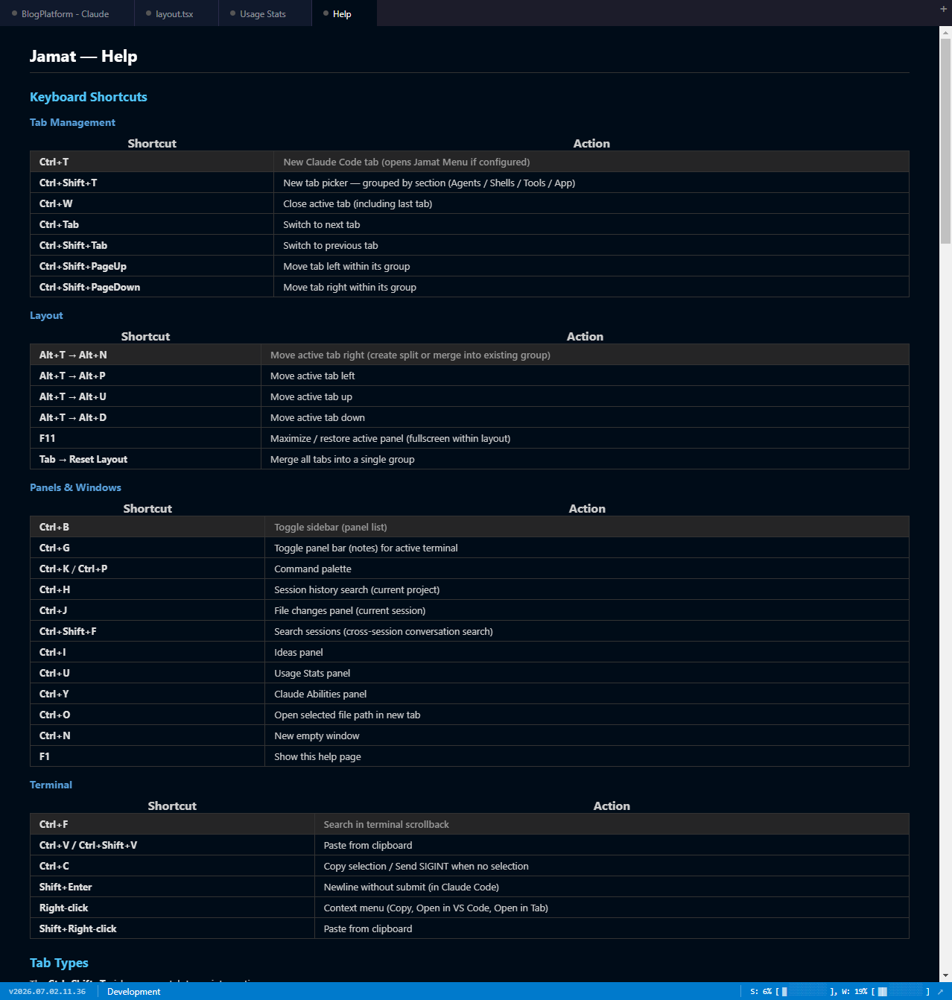<br>**Help** — every keyboard shortcut and tab type on one page.                                                                                                     | 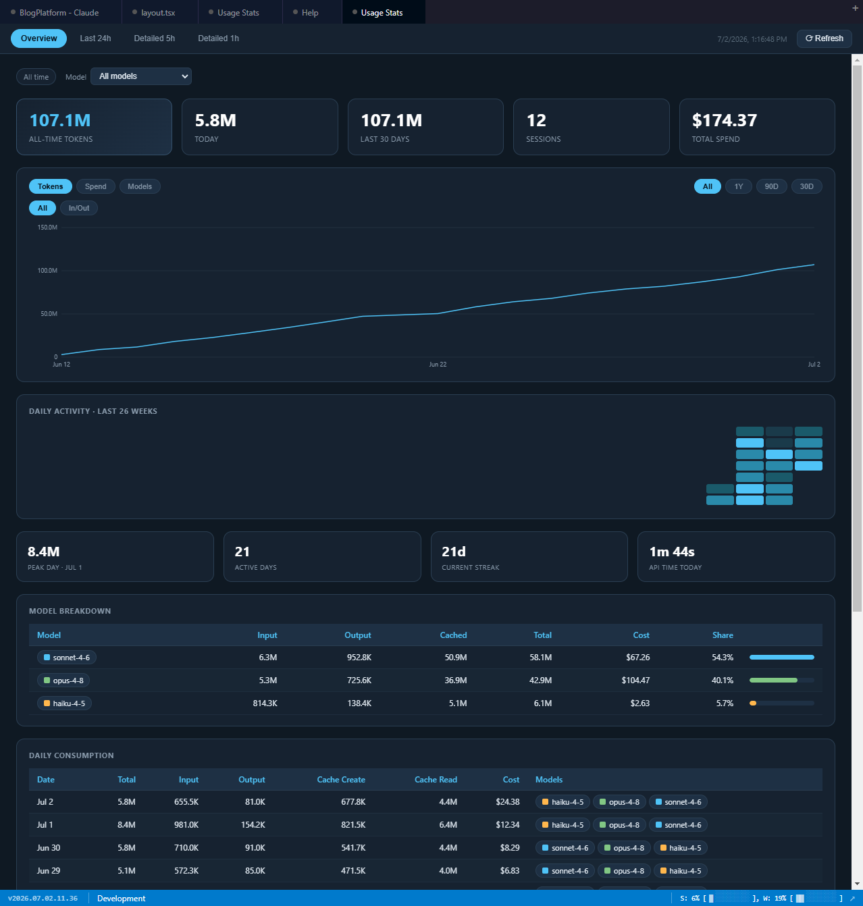<br>**Usage stats** — tokens, spend, model breakdown and daily consumption across your sessions.                      |
| 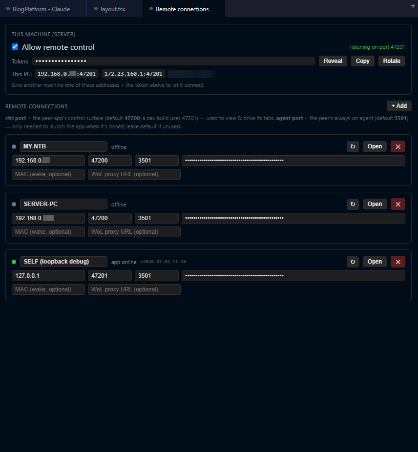<br>**Remote connections** — allow token-gated LAN control on this machine, then view & drive tabs on your other computers.              | 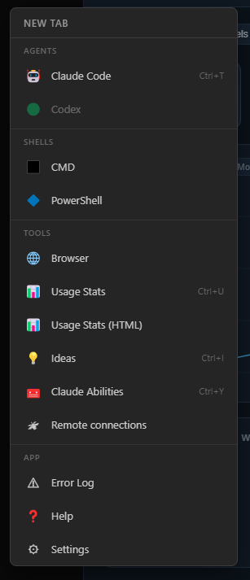<br>**New-tab picker** — Ctrl+Shift+T opens a grouped launcher (Agents / Shells / Tools / App).                 |
| 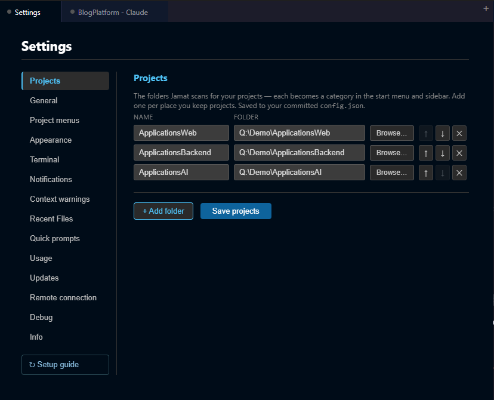<br>**Settings** — projects, appearance, terminal, notifications, usage, remote… all from the UI.                                                            | 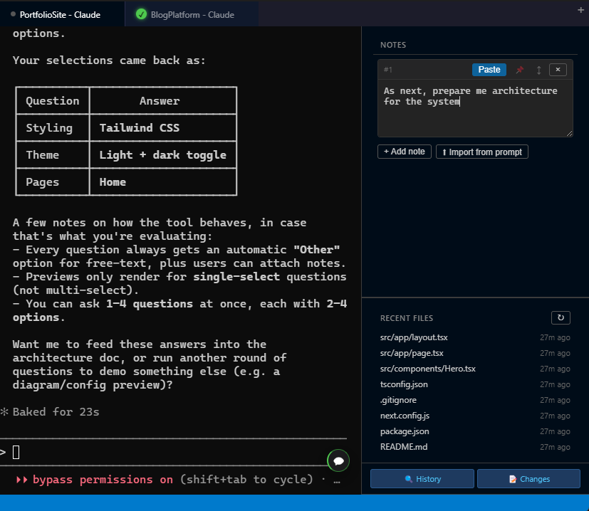<br>**Notes & recent files** — one-click reusable prompts, plus the files this session changed.                         |
| 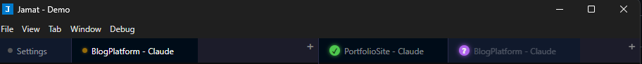<br>**Per-tab status** — a colored dot per tab shows working / waiting-on-you / done, across every window.                                                | 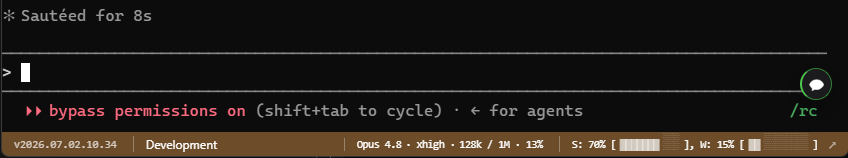<br>**Status bar** — model, reasoning effort, context used, and hourly (S) / weekly (W) usage meters.                    |
| 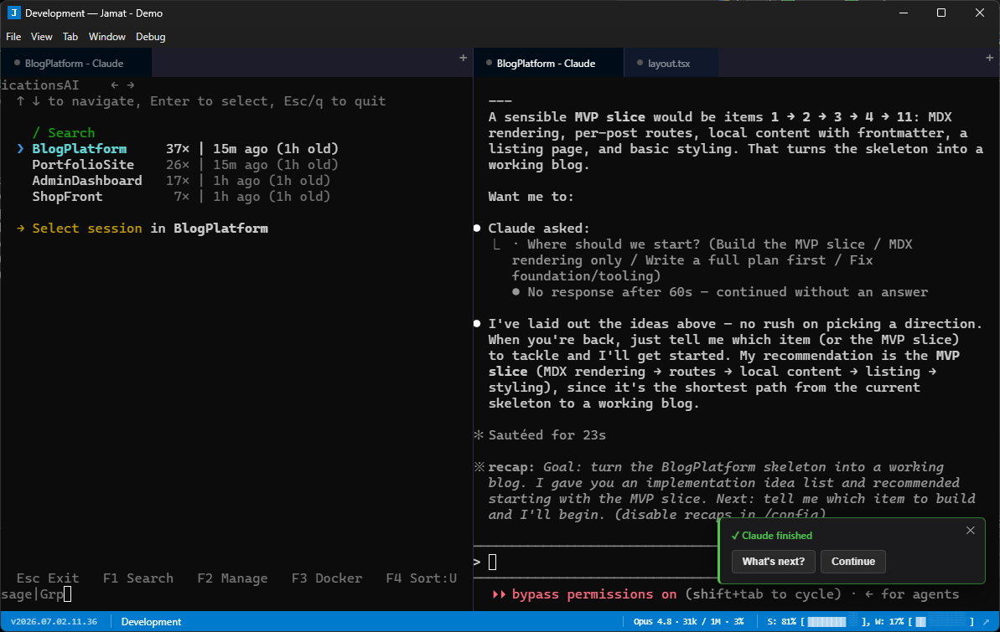<br>**Overview** — the tiling workspace: project & session selector on the left, a live agent tab on the right.                                              | 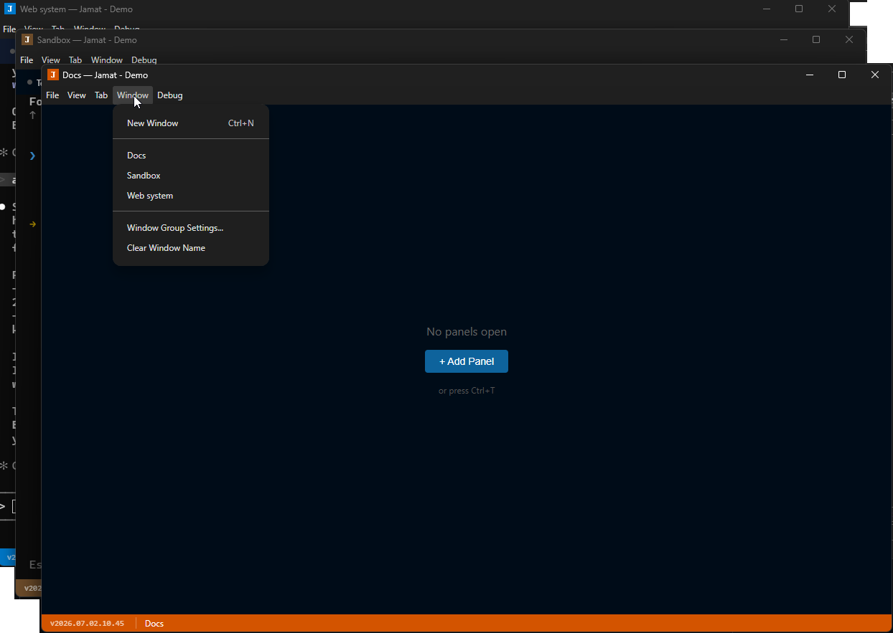<br>**Colored window groups** — name & color windows to tell topic groups apart.                                  |
| 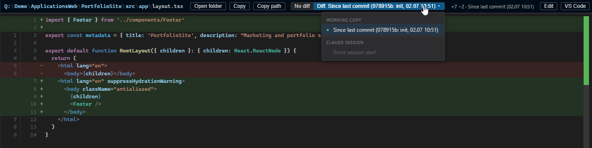<br>**Diff view** — compare against a git commit, an svn base, or a point in the Claude session.                                                            | 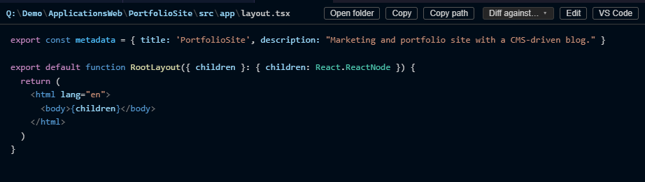<br>**File view** — breadcrumb + Open folder / Copy / Diff / Edit / VS Code over highlighted source.                       |
| 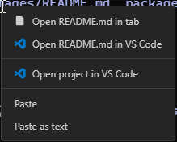<br>**Open any mentioned file** — right-click a file path in a session's output to open it in a tab or VS Code, or open the whole project. | 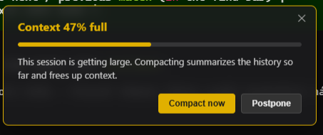<br>**Context-full nudge** — a one-click **Compact now** prompt when a session gets large, at thresholds you set. |

## AI that operates AI

An agent in Jamat isn't trapped inside its own tab — through the built-in **`jamat` skill**, the
agent can drive Jamat itself, with the same reach over the app's control surface that you have:

- **Spin up a local helper** — an agent can open a **new tab on this machine**, start a fresh Claude
  in it, delegate a sub-task there, and collect the result — parallelizing its own work.
- **Hand a task to another computer** — with remote control enabled, an agent can send a task to a
  Claude on a **peer machine** over your LAN and await its answer, so the box with the right code,
  data, or hardware does the work.
- **Open, drive, and close tabs** — locally or on a peer, so one orchestrating agent can fan work out
  across tabs and machines.

Because this is genuine remote-execution reach, it's locked down by default: remote control is
**off until you opt in** and loopback-only, the LAN surface is **token-gated per machine**, the
operation registry is **closed-by-default**, every remote action is **audit-logged**, and a peer's
reply is always treated as **untrusted input**. See [Security](#security).

## Documents that render, not just scroll

Jamat's file viewer renders an enriched Markdown — **mdext** — so the reports your agents write
actually look like reports: GFM tables and syntax-highlighted code, a collapsible frontmatter strip,
typed callouts / status chips / collapsibles, and inline diagrams (**Mermaid, Graphviz, Vega-Lite,
Archify**, plus hand-authored SVG) — all themed, all safe on untrusted input (raw HTML is stripped).

It ships with a **skill that teaches the agent to author in this format**, so a plan, analysis, or
status report comes out as a rich, diagram-bearing document instead of a wall of text. The page below
is what Jamat rendered after asking an agent to **map Jamat's own architecture** — a single mdext
document ([`docs/jamat-architecture.md`](docs/jamat-architecture.md)) with an Archify system diagram
and a component grid, shown live in the file viewer:

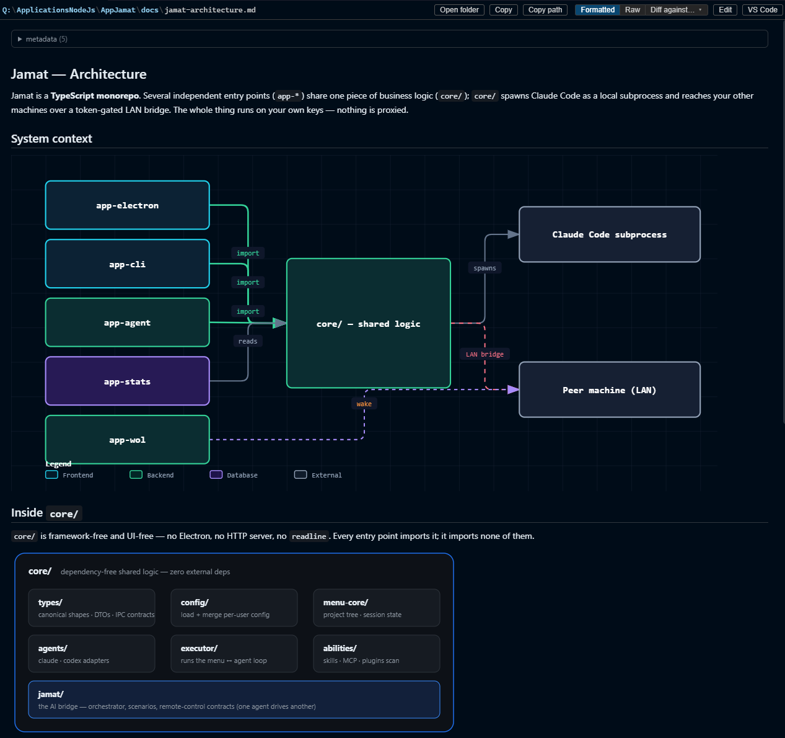

## Architecture

Jamat is a TypeScript monorepo; several entry points share one core of business logic.

| Folder               | What it is                                                                                                                                                                                                                 |
| -------------------- | -------------------------------------------------------------------------------------------------------------------------------------------------------------------------------------------------------------------------- |
| `core/`              | Shared, dependency-free logic (types, config, project engine, agent adapters, the AI bridge).                                                                                                                              |
| `app-electron/`      | The desktop app — Electron + React + [dockview](https://dockview.dev) + [xterm.js](https://xtermjs.org) + [node-pty](https://github.com/microsoft/node-pty).                                                               |
| `app-cli/`           | A terminal menu + a scriptable bridge client (`jamat`).                                                                                                                                                                    |
| `app-agent/`         | A per-machine REST API + a small LAN relay + the mobile launch web app.                                                                                                                                                    |
| `app-stats/`         | Usage / cost dashboard (ccusage → HTML).                                                                                                                                                                                   |
| `app-wol/`           | A standalone Wake-on-LAN proxy for an always-on device.                                                                                                                                                                    |
| `dockerized-claude/` | A Docker image (`Dockerfile` + `entrypoint.sh`) that runs Claude Code sandboxed in a container — non-root user, `--dangerously-skip-permissions`, privileges dropped via gosu.                                             |
| `skills/`            | Claude Code skills that ship with the app — `jamat` (drive the bridge from an agent) and `mdext-renderer` (Markdown/diagram authoring guidance); surfaced into `~/.claude/skills` (run `bin/enable-jamat-skill.ps1` once). |
| `scripts/`           | Build, version-bump, demo-seeding, and the `smoke-*.ts` test suite (run by `npm test`).                                                                                                                                    |
| `configs/`           | The public `config.example.json` template — copy it to create your own per-user config.                                                                                                                                    |
| `bin/`               | Cross-platform launchers — `start`, `start-dev`, `start-menu` (`.bat` + `.sh`) — plus the one-time `enable-jamat-skill.ps1` setup.                                                                                         |

## Quick start

**Prerequisites:** Node.js 20+, Windows, and [Claude Code](https://www.anthropic.com/claude-code)
installed and on your `PATH`.

```bash
# 0. Clone the repo
git clone https://github.com/ludekvodicka/jamat && cd jamat

# 1. Install dependencies (two installs: root + the Electron app)
npm install
cd app-electron && npm install && cd ..

# 2a. Run the desktop app — first launch opens a guided Settings wizard; no config to edit
bin\start.bat                   # compiled app (builds on first run); arg: bin\start.bat <config-dir>
bin\start-dev.bat               # …or dev mode (electron-vite).  mac/linux: bin/start.sh · bin/start-dev.sh

# 2b. …or the terminal menu (headless — seeds a starter config + prints what to edit)
bin\start-menu.bat              # the app-cli TUI (mac/linux: bin/start-menu.sh); arg: <config-dir>

# 2c. …or the mobile-remote agent server
node --import tsx app-agent/agent-server.ts    # optional: --config-dir <dir>
```

All portable state (config, app-state, usage, stats, ideas) lives in one **config-dir** — default
`~/.jamat`, or pass `bin/start.bat <config-dir>` / `--config-dir <dir>` (point it at a synced folder to
share settings across machines, or an empty dir for a fresh wizard).

**Desktop:** on first launch Jamat seeds a starter config and opens **Settings** with a _Get started_
checklist — add a project folder (native picker), pick your agent, done. Everything is editable from
Settings later; you never touch JSON. See [docs/onboarding.md](docs/onboarding.md) /
[docs/configuration.md](docs/configuration.md).

## Security

Jamat can expose a LAN control surface (launch sessions, open tabs, inject into a remote agent), so
treat it like any tool with remote-execution reach:

- **Remote control and the AI bridge are off by default** and loopback-only until you opt in.
- The LAN surface is **token-gated** (each machine has its own key), the operation registry is
  **closed-by-default**, remote file access is **path-scoped**, and **every remote action is
  audit-logged**.
- Only enable LAN control on networks you trust.

Found a vulnerability? Please report it privately — see [SECURITY.md](SECURITY.md).

## Roadmap

Honest "soon", no dates:

- macOS & Linux builds
- More agents via the pluggable adapter layer (Codex / GPT and others)
- A native mobile app that remote-controls the desktop app directly

## FAQ

**Does it send my code anywhere?** No. Jamat runs Claude Code as a local subprocess on your own
machine and your own keys — nothing is proxied through us. The only traffic is Claude Code's own
calls to Anthropic, plus the optional LAN bridge between _your_ machines (off by default).

**Subscription or API key?** Either — Jamat drives the Claude Code CLI, so whatever you logged it in
with (a Claude subscription or an Anthropic API key) is what it uses.

**Why Windows only?** Built and used on Windows first; the code is largely cross-platform and
macOS / Linux builds are on the roadmap — just not tested yet.

**Do I need all the `app-*` parts?** No. The desktop app (`app-electron`) is all you need; `app-agent`
(phone / LAN remote), `app-stats` and `app-wol` are optional add-ons.

## Contributing

Issues and PRs are welcome — see [CONTRIBUTING.md](CONTRIBUTING.md) and our
[Code of Conduct](CODE_OF_CONDUCT.md).

## The story

Jamat is a personal project, built in spare time to scratch one developer's own itch: running a
growing pile of Claude Code agents across several machines without losing the plot. It worked well
enough day-to-day that it seemed worth sharing — so it's open source, self-hosted, and free.

## Star & feedback

If Jamat is useful to you, a ⭐ helps others find it. Ideas, questions and bug reports are very
welcome — open a [Discussion](https://github.com/ludekvodicka/jamat/discussions) or an
[Issue](https://github.com/ludekvodicka/jamat/issues).

## License

[MIT](LICENSE) © Jamat contributors.

---

_Not affiliated with Anthropic. "Claude" and "Claude Code" are products of Anthropic; Jamat is an
independent tool that runs them as your own local subprocesses, on your own keys._
