<p align="center">
  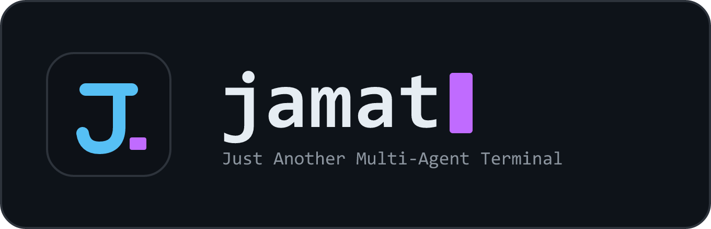
</p>

# Jamat

**Just Another Multi-Agent Terminal** — an open-source desktop control center for running many
[Claude Code](https://www.anthropic.com/claude-code) sessions in one tiling workspace, and for
reaching the sessions running on your other computers across the network — including letting one
AI agent operate another's tab.

> **Status:** A tool I've built over ~5 months and use every day myself — now open-sourced. It's still
> an early **WIP**: until now it was internal-only, so expect rough edges. **Windows is first-class;
> macOS/Linux ship as beta installers** — Claude Code today, more agents soon. A spare-time project —
> no company, no promises beyond "soon".

[](https://github.com/ludekvodicka/jamat/releases/latest)
[](LICENSE)
[](https://github.com/ludekvodicka/jamat/actions)
[](#download)
[-%E2%89%A520-339933.svg?logo=node.js&logoColor=white)](#build-from-source)


---

## Download

### **[⬇ Download the latest release](https://github.com/ludekvodicka/jamat/releases/latest)**

Grab a **ready-to-run installer** below — no repo clone, no build step — or [build it from source](#build-from-source) yourself.

| Platform                          | File                        | Notes                                                                                       |
| --------------------------------- | --------------------------- | ------------------------------------------------------------------------------------------- |
| **Windows**                       | `Jamat.Setup.<version>.exe` | First-class (daily-driven). Unsigned, so SmartScreen warns once — click **More info → Run anyway**.          |
| **Linux** _(beta)_                | `Jamat-<version>.AppImage`  | `chmod +x` then run; some distros need `libfuse2`.                                          |
| **macOS** _(beta, Apple Silicon)_ | `Jamat-<version>-arm64.dmg` | Gatekeeper: **right-click → Open** the first time (or `xattr -cr /Applications/Jamat.app`). |

**Requires** only [Claude Code](https://www.anthropic.com/claude-code) on your `PATH` — the app bundles its own runtime, so there's **no separate Node.js install**. (You only need [Node](https://nodejs.org) if you install Claude Code via npm rather than its native installer.) Windows and Linux builds **auto-update** from GitHub Releases; macOS updates manually until the app is signed.

**Verify your download:** every release ships a **`SHA256SUMS.txt`** with the installer hashes — the builds are unsigned, so check yours before running (`sha256sum -c SHA256SUMS.txt`, or PowerShell `Get-FileHash <file> -Algorithm SHA256`).

Want to hack on Jamat, or run the CLI / agent instead of the desktop app? [Build from source](#build-from-source).

---

## What it does

You're running Claude Code in five tabs — and another two on the PC in the next room. Jamat puts
every session in one tiling workspace, shows you which agent is **working** and which is **waiting
on you**, and lets you reach (or hand work to) the agents on your **other machines**. Open source,
self-hosted, your keys — nothing is proxied.

**Day to day:**

- **Quick project & session selector** — a command palette lists your projects and each project's
  recent sessions; resume the exact session by name or open a new tab, no hunting for `--resume` IDs.

  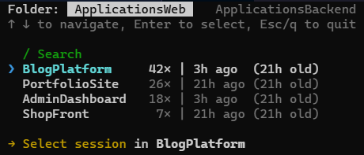

- **Easy compaction** — when context fills up, a one-click **Compact now** nudge runs `/compact` at
  thresholds you set (also on the status bar and the tab menu).

  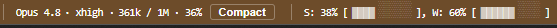

- **Predefined messages** — reply to a finished agent in one click: "Continue", "Summarize", or your
  own quick prompts, typed & sent for you.

  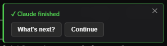

- **Detailed Claude stats** — a usage dashboard breaks cost & tokens down by project and model
  (input / output / cache), across 1h / 5h / 24h windows.

  

…plus cross-machine control, AI-operates-AI, phone access, and skill/MCP management — see
**Highlights** below.

## Why Jamat?

Plain terminal tabs, a VS Code window, or a session multiplexer each solve part of this — Jamat is
the combination, aimed specifically at _many_ Claude Code agents:

- **vs. terminal tabs / tmux** — tabs don't tell you which agent is _working_ vs _waiting on you_, or
  survive a reboot with the layout intact. Jamat does both, and adds diffs, usage stats and a session
  picker on top.
- **vs. an IDE** — an editor runs one integrated assistant in one window. Jamat is built for running
  and _watching many_ agents at once — and for the non-code "a folder per topic" workflow too.
- **vs. single-machine session managers** (claude-squad, Nimbalyst, Conductor) — those orchestrate
  sessions on one box. Jamat reaches **across machines** on your LAN, and lets **one agent operate
  another's tab**.

Against that direct category — dedicated multi-session managers:

|  | **Jamat** | claude-squad | Nimbalyst | Conductor |
| --- | --- | --- | --- | --- |
| App type | Desktop tiling workspace (multi-window) | Terminal TUI | Desktop app (kanban + visual editors) | macOS desktop app |
| Working / waiting-on-you status | ✅ live, per tab, across windows & machines | ~ session states | ~ session list / kanban | ✅ |
| Parallel isolation via git worktrees | — runs in your real folders | ✅ | ✅ | ✅ |
| Any folder as a workspace (non-code topics) | ✅ | — needs a git repo | — repo-centric | — repo-centric |
| Cross-machine control (LAN) | ✅ drive sessions on your other PCs | — | — | — |
| AI operates AI (an agent drives another's tab) | ✅ local & remote | — | — | — |
| Phone access | ✅ web launcher + Wake-on-LAN | — | ✅ iOS app | — |
| Usage / cost dashboard | ✅ per project & model | — | — | — |
| Diff review | ✅ git + SVN, per session / per message | ✅ | ✅ | ✅ |
| Agents beyond Claude Code | ~ adapter layer (more soon) | ✅ Codex, Gemini, Aider | ✅ Codex (+ alpha: OpenCode, Copilot) | ✅ Codex, Cursor |
| Platforms | Windows (macOS / Linux beta) | macOS / Linux | macOS / Windows / Linux (+ iOS) | macOS |
| License | MIT | AGPL-3.0 | MIT | Closed source (free) |

<sup>✅ = yes · ~ = partial · — = not offered or not documented by the project. Feature sets as of July 2026 — corrections welcome via an issue.</sup>

## Not just for code — a workspace per topic

You don't have to use Jamat for programming. Every "project" is just a **folder**, so you can give
each thing in your life its own — _garden_, _pool_, _house renovation_, _taxes_ — and Jamat turns
each into an entry in the selector.

Instead of one long, forgetful chat, you get a **persistent, topic-scoped conversation**:

- **Pick a topic and continue where you left off** — the project & session selector opens the right
  folder and resumes its conversation by name; the AI already has the whole history, no re-explaining.
- **Drop in documents** — put PDFs, notes, quotes, or photos in the folder (renovation invoices, the
  pool-pump manual); the agent reads them as part of that topic's context.
- **It remembers** — each folder keeps its own session history and notes, so last month's discussion
  is still there the next time you open it.
- **Everything stays local** — the folders and their history live on your disk, on your own keys.

Jamat is then as much a **filing cabinet of ongoing AI conversations** as a developer tool — one
drawer per subject, each with full memory and its own documents.

## Highlights

- **Every session in one window** — tiling, dockable, multi-window / multi-tab workspace with full
  position / size / layout persistence, named & colored windows, and per-directory project selection.
- **Never lose an agent** — live per-tab **working / waiting-on-you / completed** detection, so at a
  glance you always know which tab is busy and which one is waiting on you.

  

- **See exactly what changed** — diffs **by git/SVN history, by session, or by individual message**;
  file / changes / directory viewers; session search across all projects; commit helpers (never
  auto-commits).

  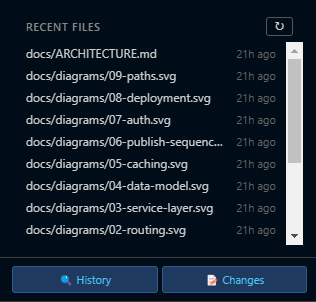

- **Jump from output to source** — right-click any file path mentioned in a session's output to open
  it in a Jamat tab or in VS Code, or open the whole project in VS Code.

  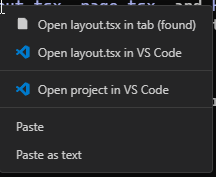

- **Reach across machines** — over your LAN, take over a session running on another computer, or
  hand a task to a remote agent; the remote work shows up in a dedicated, highlighted tab.

  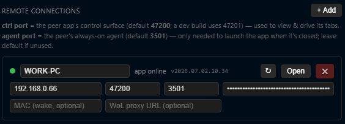

- **AI that operates AI** — one agent can drive another agent's tab (this machine or another),
  handing over context and data — full UI-level control, not just a CLI hook.
- **From your phone** — no Jamat mobile app: a session Jamat launches for remote use comes up with
  **Claude Code's own remote** (`--remote-control`) already enabled, so you drive it from your phone
  in Claude Code's native remote interface. An optional self-hosted relay adds Wake-on-LAN + launch.
- **Insight & extensibility** — discover and toggle Claude **skills, slash-commands, subagents, MCP
  servers, and plugins** from inside the app; rich Markdown + diagram rendering (Mermaid, Graphviz,
  Vega-Lite, Archify).

## Screenshots

|  |  |
| --- | --- |
| <br>**Overview** — the tiling workspace: project & session selector on the left, a live agent tab on the right. | <br>**Colored window groups** — name & color windows to tell topic groups apart. |
| <br>**Remote connections** — allow token-gated LAN control on this machine, then view & drive tabs on your other computers. | <br>**New-tab picker** — Ctrl+Shift+T opens a grouped launcher (Agents / Shells / Tools / App). |
| <br>**Diff view** — compare against a git commit, an svn base, or a point in the Claude session. | <br>**File view** — breadcrumb + Open folder / Copy / Diff / Edit / VS Code over highlighted source. |
| <br>**Open any mentioned file** — right-click a file path in a session's output to open it in a tab or VS Code, or open the whole project. | <br>**Context-full nudge** — a one-click **Compact now** prompt when a session gets large, at thresholds you set. |
| <br>**Notes & recent files** — one-click reusable prompts, plus the files this session changed. | <br>**Settings** — projects, appearance, terminal, notifications, usage, remote… all from the UI. |
| <br>**Usage stats** — tokens, spend, model breakdown and daily consumption across your sessions. | <br>**Help** — every keyboard shortcut and tab type on one page. |

## Remote connections

Turn on token-gated LAN control and Jamat reaches across your machines — driven **by you** or **by
an agent**.

**Human mode.** From the Remote connections panel you take over another PC: watch its live windows &
tabs, **fork** any running Claude into a new tab (history intact), open a fresh session, **view any
file read-only** (path-scoped to the peer's project roots), or restart its app — every local action,
now over the LAN.

<p align="center">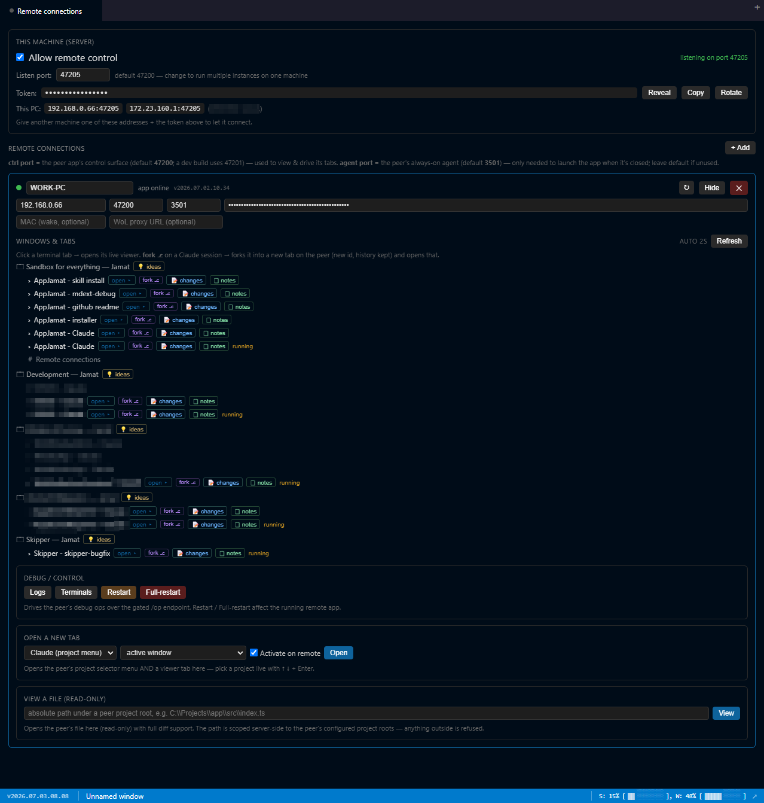</p>

A peer's session opens right inside your workspace as its own highlighted tab, streaming live:

<p align="center">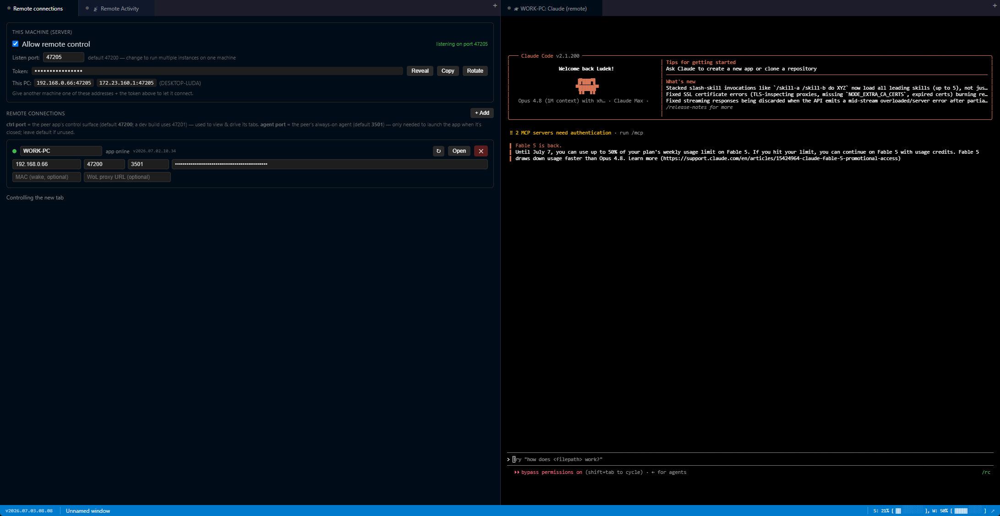</p>

**AI mode.** The same control surface is open to an agent, not just to you — so one Claude can
operate another. That's next.

## AI that operates AI

An agent in Jamat isn't trapped inside its own tab — through the built-in **`jamat` skill**, the
agent can drive Jamat itself, with the same reach over the app's control surface that you have:

- **Spin up a local helper** — an agent can open a **new tab on this machine**, start a fresh Claude
  in it, delegate a sub-task there, and collect the result — parallelizing its own work.
- **Hand a task to another computer** — with remote control enabled, an agent can send a task to a
  Claude on a **peer machine** over your LAN and await its answer, so the box with the right code,
  data, or hardware does the work.
- **Open, drive, and close tabs** — locally or on a peer, so one orchestrating agent can fan work out
  across tabs and machines.

Here one local Claude, handed **`connect to WORK-PC and run tests on AppJamat`**, is driving the
bridge itself — reaching the peer machine and getting to work, no human in the loop:

<p align="center">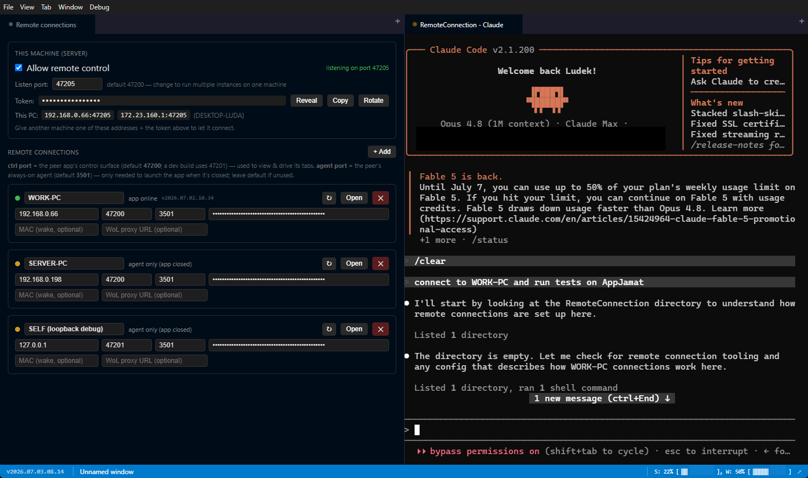</p>

Because this is genuine remote-execution reach, it's locked down by default: remote control is
**off until you opt in** and loopback-only, the LAN surface is **token-gated per machine**, the
operation registry is **closed-by-default**, every remote action is **audit-logged**, and a peer's
reply is always treated as **untrusted input**. See [Security](#security).

## Documents that render, not just scroll

Jamat's file viewer renders an enriched Markdown — **mdext** — so the reports your agents write
actually look like reports: GFM tables and syntax-highlighted code, a collapsible frontmatter strip,
typed callouts / status chips / collapsibles, and inline diagrams (**Mermaid, Graphviz, Vega-Lite,
Archify**, plus hand-authored SVG) — all themed, all safe on untrusted input (raw HTML is stripped).

It ships with a **skill that teaches the agent to author in this format**, so a plan, analysis, or
status report comes out as a rich, diagram-bearing document instead of a wall of text. Below is what
Jamat rendered after asking an agent to **map Jamat's own architecture** — a single mdext document
([`docs/jamat-architecture.md`](docs/jamat-architecture.md)) with an Archify system diagram, a package
map, and a cross-machine sequence, shown live in the file viewer:


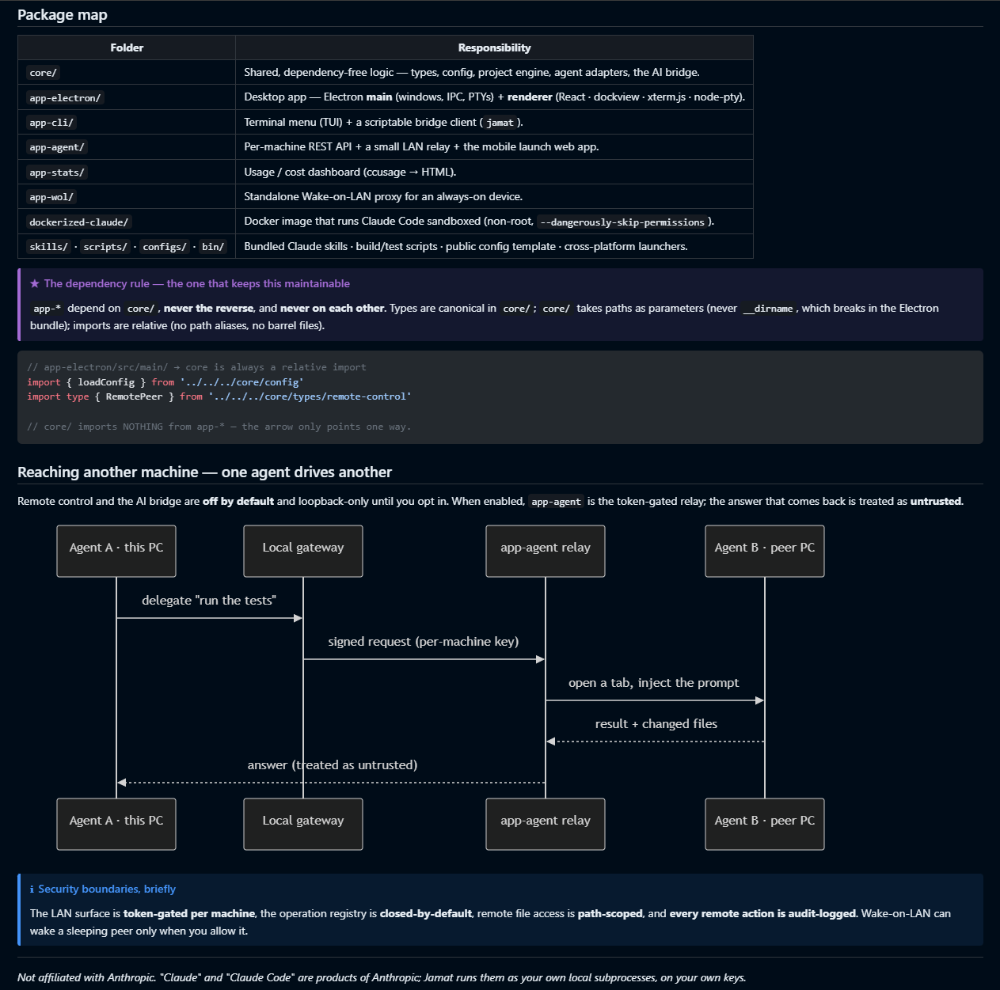

## Architecture

Jamat is a TypeScript monorepo; several entry points share one core of business logic.

| Folder               | What it is                                                                                                                                                                                                                                                                                                                                              |
| -------------------- | ------------------------------------------------------------------------------------------------------------------------------------------------------------------------------------------------------------------------------------------------------------------------------------------------------------------------------------------------------- |
| `core/`              | Shared, dependency-free logic (types, config, project engine, agent adapters, the AI bridge).                                                                                                                                                                                                                                                           |
| `app-electron/`      | The desktop app — Electron + React + [dockview](https://dockview.dev) + [xterm.js](https://xtermjs.org) + [node-pty](https://github.com/microsoft/node-pty).                                                                                                                                                                                            |
| `app-cli/`           | A terminal menu + a scriptable bridge client (`jamat`).                                                                                                                                                                                                                                                                                                 |
| `app-agent/`         | A per-machine REST API, plus an optional self-hosted relay + small web launcher to Wake-on-LAN a PC and start a session from a phone (you then drive it in Claude Code's own remote).                                                                                                                                                                                                                                                                                 |
| `app-stats/`         | Usage / cost dashboard (ccusage → HTML).                                                                                                                                                                                                                                                                                                                |
| `app-wol/`           | A standalone Wake-on-LAN proxy for an always-on device.                                                                                                                                                                                                                                                                                                 |
| `dockerized-claude/` | A Docker image (`Dockerfile` + `entrypoint.sh`) that runs Claude Code sandboxed in a container — non-root user, `--dangerously-skip-permissions`, privileges dropped via gosu.                                                                                                                                                                          |
| `skills/`            | The two Claude Code skills that ship with the app — `jamat` (drive the bridge from an agent) and `mdext-renderer` (Markdown/diagram authoring guidance). The desktop app junctions them into `~/.claude/skills` **automatically on every launch** — no manual setup; `bin/enable-jamat-skill.ps1` is a one-time fallback if you only run the CLI/agent. |
| `scripts/`           | Build, version-bump, demo-seeding, and the `smoke-*.ts` test suite (run by `npm test`).                                                                                                                                                                                                                                                                 |
| `configs/`           | The public `config.example.json` template — copy it to create your own per-user config.                                                                                                                                                                                                                                                                 |
| `bin/`               | Cross-platform launchers — `start`, `start-dev`, `start-menu` (`.bat` + `.sh`) — plus `enable-jamat-skill.ps1`, a one-time fallback for linking the skills without the desktop app.                                                                                                                                                                     |

## Build from source

**Most people should just [download an installer](#download).** Build from source only to hack on
Jamat, or to run the CLI / agent entry points.

**Prerequisites:** Node.js 20+ and [Claude Code](https://www.anthropic.com/claude-code) installed and
on your `PATH`.

```bash
# 0. Clone the repo
git clone https://github.com/ludekvodicka/jamat && cd jamat

# 1. Install dependencies (two installs: root + the Electron app)
npm install
cd app-electron && npm install && cd ..

# 2a. Run the desktop app — first launch opens a guided Settings wizard; no config to edit
bin\start.bat                   # compiled app (builds on first run); arg: bin\start.bat <config-dir>
bin\start-dev.bat               # …or dev mode (electron-vite).  mac/linux: bin/start.sh · bin/start-dev.sh

# 2b. …or the terminal menu (headless — seeds a starter config + prints what to edit)
bin\start-menu.bat              # the app-cli TUI (mac/linux: bin/start-menu.sh); arg: <config-dir>

# 2c. …or the per-machine agent server (REST API for the CLI + the optional phone relay)
node --import tsx app-agent/agent-server.ts    # optional: --config-dir <dir>
```

All portable state (config, app-state, usage, stats, ideas) lives in one **config-dir** — default
`~/.jamat`, or pass `bin/start.bat <config-dir>` / `--config-dir <dir>` (point it at a synced folder to
share settings across machines, or an empty dir for a fresh wizard).

**Desktop:** on first launch Jamat seeds a starter config and opens **Settings** with a _Get started_
checklist — add a project folder (native picker), pick your agent, done. Everything is editable from
Settings later; you never touch JSON. See [docs/onboarding.md](docs/onboarding.md) /
[docs/configuration.md](docs/configuration.md).

## Security

Jamat can expose a LAN control surface (launch sessions, open tabs, inject into a remote agent), so
treat it like any tool with remote-execution reach:

- **Remote control and the AI bridge are off by default** and loopback-only until you opt in.
- The LAN surface is **token-gated** (each machine has its own key), the operation registry is
  **closed-by-default**, remote file access is **path-scoped**, and **every remote action is
  audit-logged**.
- Only enable LAN control on networks you trust.

Found a vulnerability? Please report it privately — see [SECURITY.md](SECURITY.md).

## Roadmap

Honest "soon", no dates:

- Code signing, and hardening the macOS / Linux builds beyond beta
- More agents via the pluggable adapter layer (Codex / GPT and others)

## FAQ

**Does it send my code anywhere?** No. Jamat runs Claude Code as a local subprocess on your own
machine and your own keys — nothing is proxied through us. The only traffic is Claude Code's own
calls to Anthropic, plus the optional LAN bridge between _your_ machines (off by default).

**Subscription or API key?** Either — Jamat drives the Claude Code CLI, so whatever you logged it in
with (a Claude subscription or an Anthropic API key) is what it uses.

**How mature are the macOS/Linux builds?** Windows is first-class (daily-driven); macOS and Linux ship
as **beta installers** — largely cross-platform code, just less battle-tested, so expect the occasional
rough edge. Bug reports welcome.

**Do I need all the `app-*` parts?** No. The desktop app (`app-electron`) is all you need; `app-agent`
(phone / LAN remote), `app-stats` and `app-wol` are optional add-ons.

**What runs today besides Claude Code?** Claude Code is the only wired agent for now — **Codex** is in
the picker as the next adapter, but its backend isn't implemented yet. Everything else in the new-tab
picker already works: real OS **shells** (CMD / PowerShell on Windows, a Terminal on macOS/Linux) and
**tools** — Browser, Usage Stats, Ideas, Claude Abilities, Remote connections, Help, Settings.

**Does it work with WSL?** There's no dedicated WSL mode — Jamat is a native Windows app and drives the
`claude` on your Windows `PATH`. But `wsl.exe` is an allowed shell, so you can open WSL terminal tabs;
and if your Claude Code lives inside WSL, put it on the Windows `PATH` (a `claude` shim that calls
`wsl`) or run the Linux AppImage under WSLg. Neither is officially tested yet.

**Why does the Docker mode use `--dangerously-skip-permissions`?** Jamat runs agents autonomously by
default (no per-action approval prompts — the point when you're watching many at once). The optional
**Docker isolation mode** (`dockerized-claude/`) is how you contain that: Claude runs as a **non-root
user** (privileges dropped via gosu), sees only the **mounted project directory** plus a persistent
`.claude` volume, and gets **no host SSH private keys** (only `known_hosts`) — so the blast radius is
the container, not your machine.

**How heavy is it?** It's an Electron app, so expect that baseline — roughly a few hundred MB of RAM
for the UI itself, plus one lightweight `node-pty` process per open tab. The real memory is whatever
the agents and shells you launch use: five Claude sessions in Jamat cost about the same as five in
separate terminals, just gathered in one window.

## Contributing

Issues and PRs are welcome — see [CONTRIBUTING.md](CONTRIBUTING.md) and our
[Code of Conduct](CODE_OF_CONDUCT.md).

## The story

Jamat is a personal project, built in spare time to scratch one developer's own itch: running a
growing pile of Claude Code agents across several machines without losing the plot. It worked well
enough day-to-day that it seemed worth sharing — so it's open source, self-hosted, and free.

## Star & feedback

If Jamat is useful to you, a ⭐ helps others find it. Ideas, questions and bug reports are very
welcome — open a [Discussion](https://github.com/ludekvodicka/jamat/discussions) or an
[Issue](https://github.com/ludekvodicka/jamat/issues).

## License

[MIT](LICENSE) © Jamat contributors.

---

_Not affiliated with Anthropic. "Claude" and "Claude Code" are products of Anthropic; Jamat is an
independent tool that runs them as your own local subprocesses, on your own keys._
