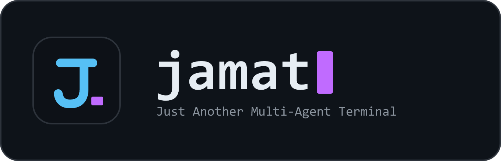
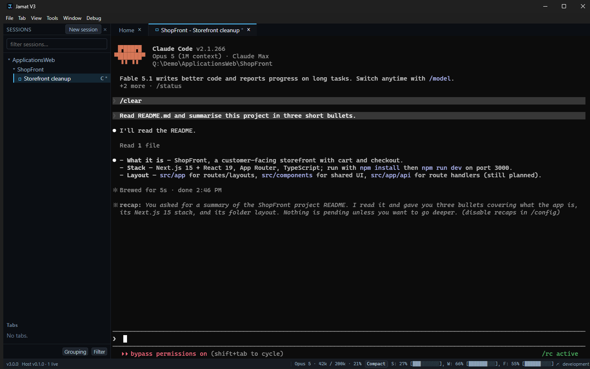
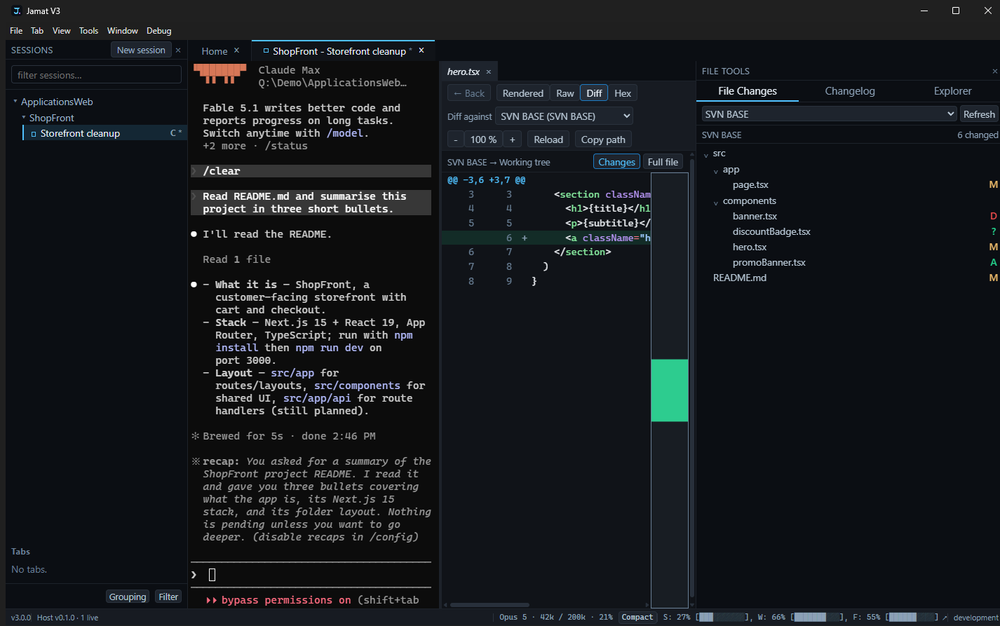
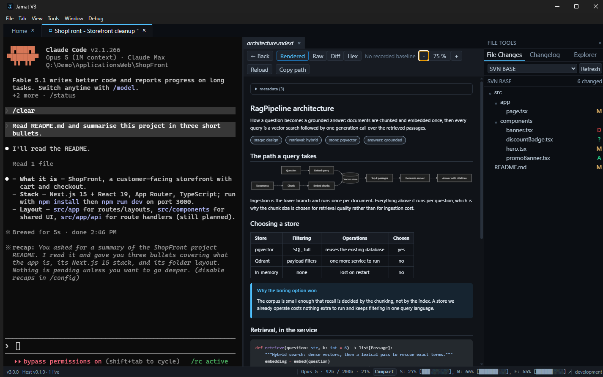
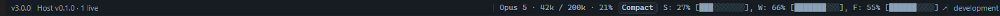
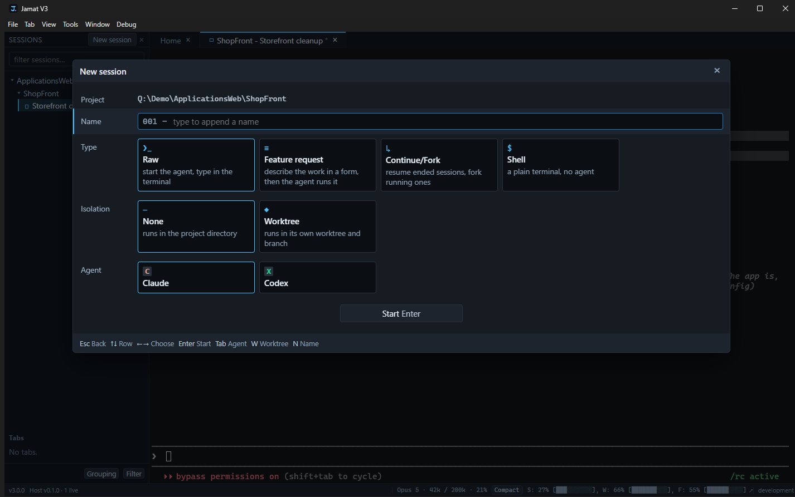
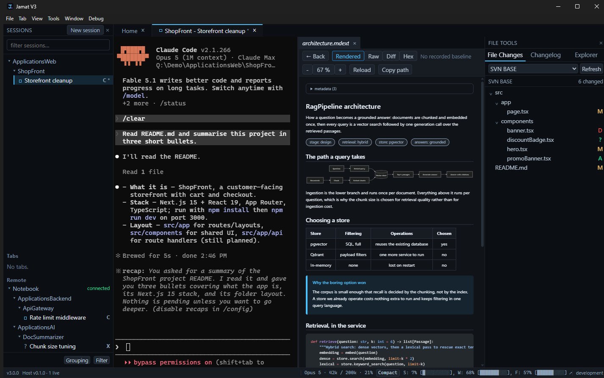

<p align="center">
  
</p>

# Jamat

**Just Another Multi-Agent Terminal.** An open-source desktop control center for running many
[Claude Code](https://www.anthropic.com/claude-code) and Codex sessions at once, on this computer
and on the other computers you own.

The sessions do not live in the window. They run in a separate host process, so closing the client,
restarting it, or crashing it leaves every agent exactly where it was.

[](https://github.com/ludekvodicka/jamat/releases/latest)
[](LICENSE)
[](https://github.com/ludekvodicka/jamat/actions)
[](#download)
[-%E2%89%A522.16-339933.svg?logo=node.js&logoColor=white)](#build-from-source)



---

## Download

### **[Download the latest release](https://github.com/ludekvodicka/jamat/releases/latest)**

A ready-to-run installer, no clone and no build step. Or [build it from source](#build-from-source).

| Platform | File | Notes |
| --- | --- | --- |
| **Windows** | `Jamat-Setup-<version>.exe` | The platform this is developed and used on every day. Unsigned, so SmartScreen warns once: **More info, then Run anyway**. |
| **Linux** *(beta)* | `Jamat-<version>.AppImage` | `chmod +x` and run. Some distributions need `libfuse2`. |
| **macOS** *(beta, Apple Silicon)* | `Jamat-<version>-arm64.dmg` | Gatekeeper: right-click and **Open** the first time, or `xattr -cr /Applications/Jamat.app`. |

**You need at least one agent CLI** on your `PATH`: [Claude Code](https://www.anthropic.com/claude-code)
or Codex. The application carries its own runtime, so there is no separate Node.js install to do.
(You only need [Node](https://nodejs.org) if the agent CLI itself is installed through npm.)

Windows and Linux update themselves from GitHub Releases, with your consent before anything is
downloaded. macOS updates by hand until the application is signed.

**Verify what you downloaded.** Every release ships a `SHA256SUMS.txt` next to the installers.
The builds are unsigned, so check yours: `sha256sum -c SHA256SUMS.txt`, or in PowerShell
`Get-FileHash <file> -Algorithm SHA256`.

**Coming from 0.2.x?** The public version jumps from `0.2.6` to `3.0.0` because the number now
tracks the generation of the codebase, and this is the third one. There is no public 1.x or 2.x and
there never will be. An installed 0.2.x copy updates in place and **starts with fresh state**:
nothing is converted, and nothing of the old installation is deleted either. The release notes say
exactly which directories stay behind.

---

## What it does

You have five agents working and two more on the computer in the next room. Jamat puts every one of
them in one workspace, tells you which is working and which is waiting on you, and lets you reach
the ones that are not on this machine. It runs the agent CLI as a local subprocess under your own
account, on your own keys. Nothing is proxied.

The thing that shapes everything else: **a session is not owned by the window it is drawn in.** A
separate host process owns the terminals. Close the client and the agents keep working; open it
again and they are still there, output intact. That is also what makes the rest possible, because
the client is then just one of several ways to reach a session.

Every project is a folder, which is worth saying out loud: nothing requires the folder to hold code.
A directory per subject, each with its own sessions and its own history, works just as well for the
things in your life that are not software.

## Highlights

- **Sessions that outlive the window.** The host process owns every terminal. Restart the client,
  or let it crash, and the agents carry on. Only an explicit stop ends a runtime.

- **One workspace, as many windows as you want.** A sessions tree on the left, dockview tabs in the
  middle, splits, extra named and colored windows, and a layout that comes back the way you left it.

- **Working, waiting, or done, per session.** Each session's state is read live from what the agent
  is actually doing, so the tree tells you where you are needed without opening anything.

- **Diffs against the baseline that makes sense.** The working tree against a checkpoint, an SVN
  base, or the commit a worktree was cut from. Or history: a git commit, an SVN revision, or the
  state after one specific message in the conversation.

  

- **A worktree per session, if you want one.** Turn on isolation in the launcher and the session
  gets its own git worktree and branch, with the project's own setup commands run in it first, and
  a merge back when you finish. The main copy stays clean.

- **Reach your other computers.** Pair two machines and their sessions appear in each other's tree:
  list them, start one, watch it live, type into it. Off until you turn it on, and explicit in both
  directions. [More below](#remote-computers).

- **Documents that render.** The file viewer draws an enriched Markdown with tables, highlighted
  code, callouts, and inline Mermaid, Graphviz and Vega-Lite diagrams. A shipped skill teaches the
  agent to write in it, so a plan or a report comes back as a document instead of a wall of text.

  

- **Where you stand, on the status bar.** The model the front session runs on, its reasoning effort,
  context used against the window, and your rate limits for the current session and the week. The
  model and context are read from the agent's own transcript; the limits come from the provider.

  

- **Jump out of the output.** Right-click a file path an agent printed to open it in a tab or in VS
  Code, or open the directory around it.

- **An agent can drive Jamat.** The repository ships a Claude and a Codex skill over a small JSON
  command line client, so an agent can list sessions, start one, look at a terminal and type into
  it, on this machine or on a computer you have paired. Handing work to the machine that has the
  right code on it is a thing an agent can do by itself.

- **Read a page off a reMarkable.** Take the page currently on the tablet, or one page of the open
  document, and drop its path straight into the terminal that asked for it.

## Screenshots

|  |  |
| --- | --- |
| <br>**The workspace** - sessions tree, tabs, and a live agent session in a terminal panel. | <br>**The launcher** - pick a project, then the agent, the model, and whether the session gets its own worktree. |
| <br>**File changes** - what this session touched, diffed against the baseline you choose. | <br>**Rendered documents** - diagrams, tables and highlighted code in the file viewer. |
| <br>**Another computer's sessions** - a paired machine's sessions in your own tree. | <br>**The status bar** - model, effort, context used, and the rate meters. |

## Remote computers

Two running copies of Jamat can talk to each other directly. There is no relay, no cloud, no account:
one machine dials the other over your LAN or VPN.

**Pairing is explicit and mutual.** Each machine has one long-term key. You export a pairing bundle,
which carries a public key and an address and nothing else, and import it on the other side. Being
allowed to dial out and being willing to be dialed are separate rights, granted separately. Giving
another computer more access asks you to confirm its name and key fingerprint first; taking access
away asks nothing and drops live connections immediately.

**What a paired computer can do is a closed list**: see status and projects, list sessions, start
one, finish one, and attach to a terminal to watch it and type into it. Everything else is refused,
including reading files, opening tabs, reading transcripts, and pairing operations, which is what
stops one paired machine using another as a route to a third. Every accepted operation is logged,
with no tokens, no bodies, no terminal text.

**It is off until you enable it.** The listener is disabled by default, and even switched on it
advertises `127.0.0.1` until you give it a real address. The application never touches firewall
rules; that inbound rule is yours to add. Read [SECURITY.md](SECURITY.md) before opening it up.


## Architecture

A TypeScript monorepo of five packages, each with its own lockfile and its own `node_modules`. The
split is by process rather than by layer: something gets its own package because it owns state that
outlives whoever called it.

| Package | What it is |
| --- | --- |
| `app-host` | The process that owns the terminals, and the reason a session survives the client. Create, inspect, attach, input, resize, stop and remove, over a token-guarded loopback HTTP and WebSocket API. It is agent-agnostic: it spawns exactly the command, environment and terminal size it is handed, and knows nothing about Claude or Codex. No import of its own leaves the package. |
| `lib-orchestrator` | The library both clients link, and the entire seam between a client and the host. Projects and their catalog, provider session history, durable session records, launching and reconciliation, work state, file changes and diffs, file viewing, the rate, model and transcript readers, git worktrees and merges, project setup, host control, and the transport-independent remote-control contract. It owns no process, and it is where the meaning of a session lives. |
| `app-client-ui` | The Electron client. Workspace windows, native menu, status bar, sessions tree, launcher, settings, dockview tabs, live terminal panels, a Debug window, and the authenticated loopback control endpoint. It reaches the host only through `lib-orchestrator`. |
| `app-client-cli` | A short-lived JSON client for that control endpoint, and through it for paired computers. It owns no durable state, and no peer credential ever passes through it. |
| `mdext-renderer` | The renderer for the enriched Markdown the file viewer draws. Sources only; the client compiles it. |

Inside `lib-orchestrator` a directory is a subsystem, never a tier: `sessionManager/`,
`fileChangesManager/`, `fileViewer/`, `rateMonitor/`, `remoteControl/`, `git/`, and their neighbours,
each with its public surface at its root and its internals below it. The renderer imports the wire
types of those subsystems and almost never their code, which is what keeps Node out of the browser
half of the client.

[CONTRIBUTING.md](CONTRIBUTING.md) carries the rest: the conventions, how to run each surface, and
what has to be green before a change lands.

## Build from source

**Most people should just [download an installer](#download).** Build from source to work on Jamat,
or to run the command line client.

**Prerequisites:** Node.js 22.16 or newer, [pnpm](https://pnpm.io) (`corepack enable` picks up the
pinned version), and Claude Code or Codex on your `PATH`.

```bash
git clone https://github.com/ludekvodicka/jamat && cd jamat

# Five installs. All of them: typecheck compiles every package, and the smokes spawn a real host.
pnpm install
pnpm -C app-host install
pnpm -C lib-orchestrator install
pnpm -C app-client-ui install
pnpm -C app-client-cli install

pnpm run ui                                                 # the client
pnpm run host -- --config-dir <dir> --channel development   # a host on its own, if you want one
pnpm run jamat-v3 -- status                                 # the CLI against a running client

pnpm typecheck                                              # every TypeScript program
pnpm test                                                   # the unit suites
```

Configuration and state live in one directory, `~/.jamat-v3` by default, overridden with
`--config-dir` or `JAMAT_V3_CONFIG_DIR`. Every environment variable Jamat reads is named
`JAMAT_V3_*`.

## Security

Jamat starts processes, types into terminals and can be reached from another machine, so treat it
as a tool with real reach:

- **The host and the client's control endpoint listen on loopback only**, behind a token only your
  account can read.
- **The peer listener is off by default** and advertises `127.0.0.1` until you deliberately give it
  a LAN or VPN address. The application never changes firewall rules.
- **Pairing is explicit and pins the other machine's key**; the connection is signed and encrypted;
  what a peer may ask for is a closed allowlist; every accepted operation is audited.
- **A reply from a paired computer is untrusted input**, and the application marks it as such.
- Only enable the peer listener on a network you trust.

Found a vulnerability? Please report it privately, see [SECURITY.md](SECURITY.md).

## Roadmap

Honest "soon", no dates:

- Code signing on Windows and macOS.
- Proving the macOS and Linux builds on real hardware. They are built by CI on every release and
  they are not daily-driven by anyone yet.
- More agent CLIs beside Claude Code and Codex.

## FAQ

**Does my code go anywhere?** No. Jamat runs the agent CLI as a subprocess on your machine under
your account. The only traffic is the agent's own calls to its provider, plus the connection between
your own computers if you switch that on.

**Subscription or API key?** Either. Jamat drives Claude Code and Codex directly, so each one uses
whatever credentials its own CLI is already configured with. Jamat reads the stored token only to
show you your rate limits, and never writes it.

**Why does the version jump from 0.2.6 to 3.0.0?** The number now tracks the generation of the
codebase, and this is the third. The first two generations were never released publicly. The old
tags stay on this repository as the archive of the 0.x line.

**I have 0.2.x installed. What happens?** It updates in place and starts empty. Nothing is converted
and nothing is deleted; the old configuration and state directories stay on disk for you to copy
from or remove. The release notes name them.

**How solid are the macOS and Linux builds?** They are built by the same release workflow and they
have not been run on real hardware by the maintainer. The code is largely platform-neutral, so they
should work, and "should" is exactly the right amount of confidence. Bug reports very welcome.

**What can I run in a session?** Claude Code, Codex, and a plain shell. Nothing else has an adapter
yet.

**Do I need Node.js?** Not for the application, which carries its own runtime. Only if the agent
CLI you use is installed through npm.

**How heavy is it?** An Electron client, so expect that baseline, plus one small terminal process
per running session in the host. The real cost is whatever the agents themselves use: five sessions
in Jamat cost about what five sessions in five terminals cost, gathered into one window.

## Contributing

Issues and pull requests are welcome. See [CONTRIBUTING.md](CONTRIBUTING.md) and the
[Code of Conduct](CODE_OF_CONDUCT.md).

## Star and feedback

If Jamat is useful to you, a star helps other people find it. Ideas, questions and bug reports are
welcome in a [Discussion](https://github.com/ludekvodicka/jamat/discussions) or an
[Issue](https://github.com/ludekvodicka/jamat/issues).

## License

[MIT](LICENSE), and the components Jamat builds on are listed in
[THIRD-PARTY.md](THIRD-PARTY.md).

---

*Not affiliated with Anthropic or OpenAI. Claude and Claude Code are products of Anthropic; Codex is
a product of OpenAI. Jamat is an independent tool that runs them as your own local subprocesses, on
your own keys.*
