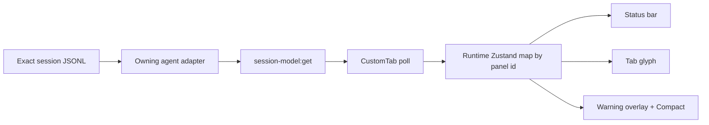

# Agent session runtime status bar

## Decision

The Electron status bar shows one normalized runtime snapshot for the active Claude Code or Codex
session:

`GPT-5.6 Sol · max · 103k / 258k · 40%`

The same snapshot drives the tab context glyph, context-warning overlay, and Compact action. It is
session-specific and separate from account rate limits and historical usage statistics.

## Normalized contract

`core/types/session.ts` defines `SessionModelInfo`:

| Field | Meaning |
|---|---|
| `model` | Provider-native effective model id |
| `modelLabel` | Adapter-owned display label |
| `effortLevel` | Provider-native reasoning/thinking effort, or `null` |
| `contextTokens` | Tokens currently occupying the context window |
| `contextWindow` | Effective maximum context window |

Each `AgentAdapter` returns the complete structure through
`readSessionModelInfo(sessionFile, projectDir, homeDir)`. Provider-specific precedence and storage
never leak into IPC or renderer code.

## Sources

| Agent | Model | Effort | Context |
|---|---|---|---|
| Claude | Latest real `assistant.message.model` | Claude settings cascade | Latest assistant usage, with `compact_boundary.postTokens` override |
| Codex | `turn_context.payload.model` | `turn_context.payload.effort` with legacy fallbacks | Following `token_count.info.last_token_usage.total_tokens` and `model_context_window` |

Codex `config.toml` is not a runtime source because profiles, CLI flags, collaboration mode, and
in-session changes can override it. Codex app-server is not used for this item because Jamat's TUI
session belongs to a separate Codex process.

## Data flow

`session-model:get` requires a valid session id, resolves its owner with
`resolveAgentForSessionId`, and reads only that adapter's exact session file. An unresolved fresh tab
returns `null`; it never falls back to a neighboring session.

`CustomTab` is the single renderer poller per panel. It polls every 8 seconds until a snapshot is
available, then every 20 seconds. Local tabs are gated by the adapter's `contextPercent` capability
and runtime terminal phase. Remote viewers call the same IPC contract on the peer. The runtime map
is not serialized into Dockview layout state and is cleared on menu transition or panel disposal.

## Codex consistency and cache

`core/agents/codex/sessionRuntime.ts` parses records in order:

1. A valid `turn_context` starts pending model/effort settings.
2. Its following valid `token_count` completes the snapshot.
3. Later token counts in the same turn replace the context count, including a lower count after
   compaction.
4. A newer turn without a token count leaves the previous complete snapshot visible rather than
   combining new settings with old context.

The first read scans a bounded 512 KiB tail. If it cannot form a complete pair, it performs one
full-file fallback. Later polls parse only appended complete JSONL rows. A partial final row waits for
the next poll. File shrink, replacement identity, or changed end fingerprint resets the cache.
Unknown and malformed records are ignored; missing model, token count, or window hides the item.

## Percentage semantics

All agents use raw occupied context:

`round(contextTokens / contextWindow * 100)`

Codex's own TUI may show a different remaining percentage because it can reserve a baseline before
calculating user-controllable space. Jamat intentionally keeps one meaning across providers: how much
of the reported window is occupied.

## Visibility

| Active surface | Session runtime item |
|---|---|
| Local running Claude tab | Claude snapshot |
| Local running Codex tab | Codex snapshot |
| Project/session menu | Hidden |
| Fresh unresolved agent tab | Hidden until its session id and first complete snapshot exist |
| Plain shell or non-terminal panel | Hidden |
| Remote Claude/Codex viewer | Peer snapshot with satellite marker |

Model labels are neutral. Only context-severity thresholds add color; a valid GPT model is not
treated as an error for not being Opus.

## Key files

- `core/agents/types.ts` — provider-neutral adapter contract
- `core/agents/claude/index.ts` — Claude complete snapshot assembly
- `core/agents/codex/sessionRuntime.ts` — paired incremental rollout parser
- `app-electron/src/main/ipc-sessions.ts` — owner-aware IPC
- `app-electron/src/renderer/components/layout/CustomTab.tsx` — single per-panel poll
- `app-electron/src/renderer/store/layout-store.ts` — volatile per-panel snapshots
- `app-electron/src/renderer/components/AgentSessionStatus.tsx` — status rendering and Compact routing
- `app-electron/src/renderer/utils/context-level.ts` — shared occupied-percentage and severity logic

The Codex storage format is observed CLI behavior rather than a public stable storage API. Keep the
parser tolerant, fixture-tested, and re-verify the fields after Codex upgrades.
