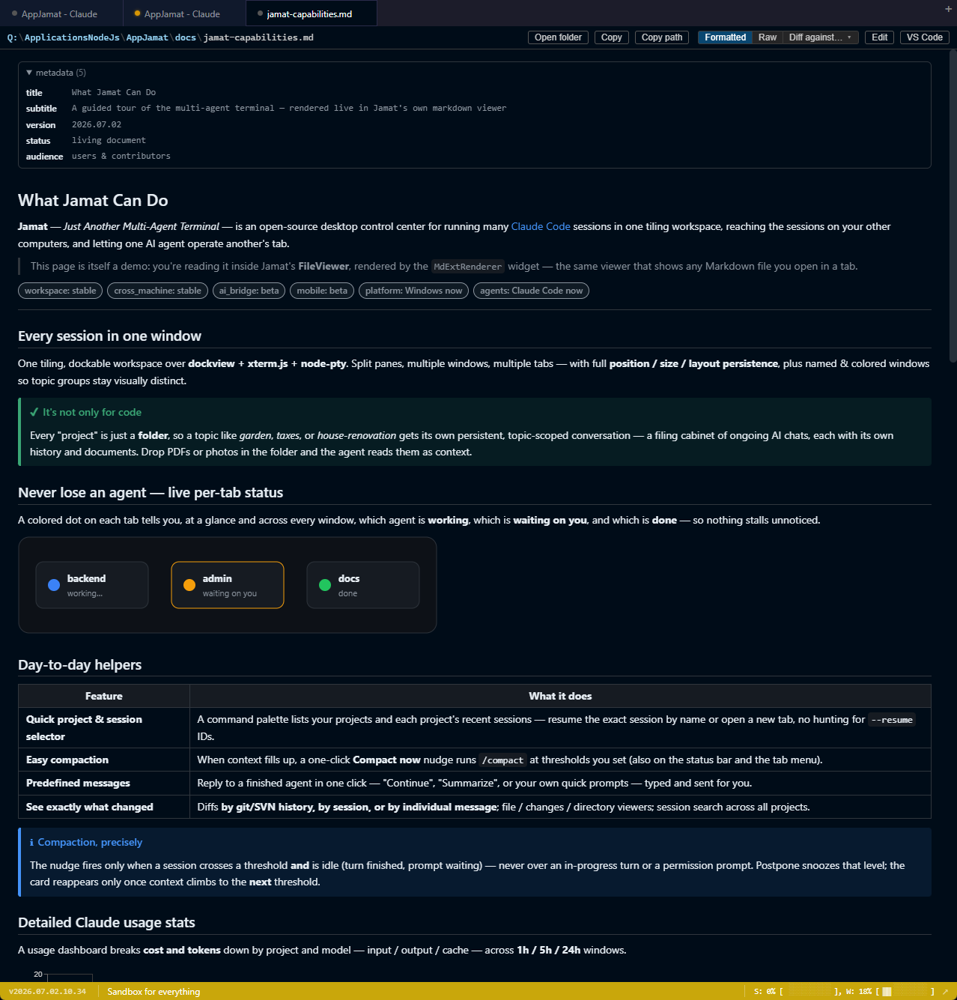
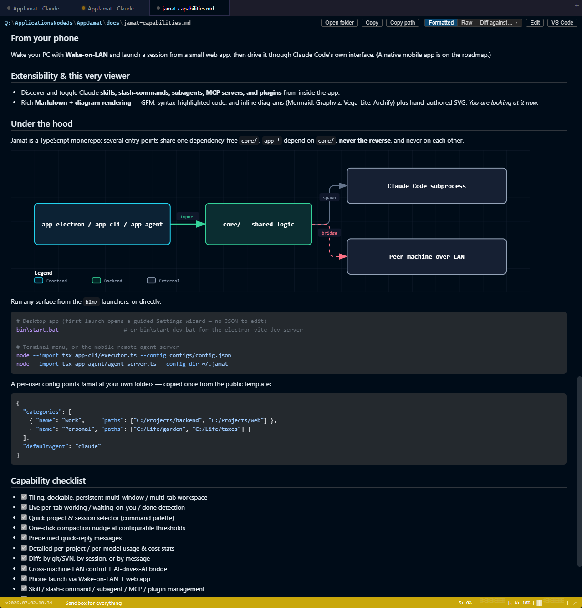
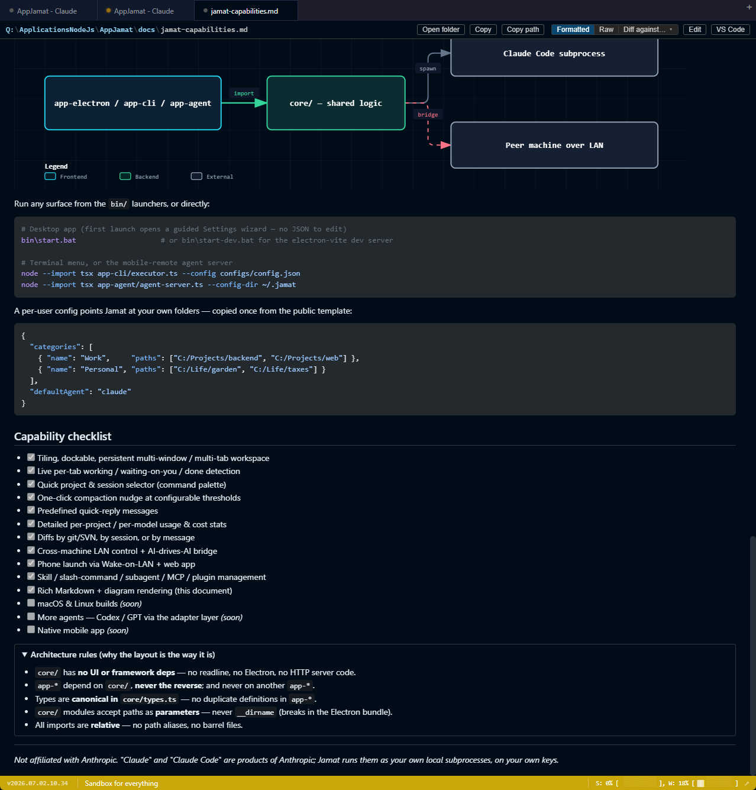

# Jamat — Screenshots

Screenshot gallery for the README and docs. Each entry is a captured view of the app with a short
note on what it shows. All shots are from a **Demo** window (dummy projects/sessions), safe to publish.

To embed one in the top-level `README.md`, reference it by relative path, e.g.
``.

| # | File | Shows |
|---|------|-------|
| 01 | [`01-overview.png`](01-overview.png) | Main overview — the whole app at a glance |
| 02 | [`02-tab-status.png`](02-tab-status.png) | Per-tab status signaling (working / waiting / done) |
| 03 | [`03-side-panel.png`](03-side-panel.png) | Side panel — prepared notes + recent files |
| 04 | [`04-file-view.png`](04-file-view.png) | File view window |
| 05 | [`05-settings.png`](05-settings.png) | Settings — what's configurable |
| 06 | [`06-diff-view.png`](06-diff-view.png) | Diff view with the "Diff against…" selector |
| 07 | [`07-window-groups.png`](07-window-groups.png) | Multiple colored windows for different tab groups |
| 08 | [`08-status-bar.png`](08-status-bar.png) | Status bar — model, context, hourly & weekly limits |
| 09 | [`09-remote-connections.png`](09-remote-connections.png) | Remote connections — LAN control & peer machines |
| 10 | [`10-file-context-menu.png`](10-file-context-menu.png) | Right-click a file mentioned in output to open it |
| — | [`output-01-capabilities.png`](output-01-capabilities.png) | Rich mdext output — frontmatter, chips, status diagram |
| — | [`output-02-diagrams.png`](output-02-diagrams.png) | Rich mdext output — architecture diagram + config + checklist |
| — | [`output-03-checklist.png`](output-03-checklist.png) | Rich mdext output — checklist + collapsible |

---

## 01 — Overview

The one image that shows what Jamat is. The tiling workspace: on the left the **project & session
selector** (folders across the top, fuzzy search, and each project's recent sessions with usage
counts and last-used times); on the right a **live Claude Code agent tab** rendering the agent's
output; the **tab bar** spanning multiple windows up top; and the **status bar** with the app
version and key shortcuts (Search, Manage, Docker, Sort) at the bottom.

## 02 — Tab status signaling

Per-tab **working / waiting-on-you / completed** detection. Each tab carries a colored dot for its
state, so at a glance you know which agent is busy and which one is waiting on you — across every
window in the workspace.

## 03 — Side panel: notes & recent files

The session side panel. **NOTES** (top) is a list of prepared, reusable notes/prompts you can paste
into the prompt in one click — add your own, or import from the current prompt. **RECENT FILES**
(bottom) lists the files changed within the session with relative timestamps, plus **History** and
**Changes** entry points.

## 04 — File view

The file view window: a path breadcrumb with quick actions (**Open folder**, **Copy**, **Copy path**,
**Diff against…**, **Edit**, **VS Code**) above syntax-highlighted source.

## 05 — Settings

The Settings screen, showing how much is configurable — a left nav across every area (**Projects**,
**General**, **Project menus**, **Appearance**, **Terminal**, **Notifications**, **Context warnings**,
**Recent Files**, **Quick prompts**, **Usage**, **Updates**, **Remote connection**, **Debug**,
**Info**), with the **Projects** pane open: the folders Jamat scans, each becoming a category in the
start menu and sidebar, saved to the committed `config.json`.

## 06 — Diff view

The file view in diff mode. The **Diff against…** selector picks the baseline to compare the current
file against, grouped into **Working copy** (git "Since last commit …" / svn "Since BASE …") and
**Claude session** (Since session start / last turn / N turns ago). The body renders a colored
line-by-line diff with add/remove markers and a per-hunk summary.

## 07 — Window groups (colored windows)

Several Jamat windows open at once, each a **named, colored window group** (Web system, Sandbox,
Docs) so you can tell them apart at a glance — the color carries into each window's status bar. The
**Window** menu manages them: **New Window**, jump to any named window, **Window Group Settings…**,
and **Clear Window Name**.

## 08 — Status bar

The per-tab status bar. Left to right: the app **version**, the run mode (**Development**), the
**model + context** readout (`Opus 4.8 · xhigh · 128k / 1M · 13%` — model, reasoning effort, context
window used / total, percentage), and the usage meters — **S** (hourly / 5-hour limit) and **W**
(weekly limit), each with a percentage and a fill bar.

## 09 — Remote connections

The Remote connections settings. **This machine (server)** toggles **Allow remote control** (off by
default), showing the port it listens on, this PC's addresses, and a **token** (reveal / copy /
rotate) another machine needs to connect. **Remote connections** lists the peer machines with their
**ctrl port** (view & drive the peer's tabs), **agent port** (launch the app when it's closed), and
per-peer token — each with an **Open** action. A **SELF (loopback debug)** entry drives this same
machine.

## 10 — File context menu

Right-clicking a **file path mentioned in a session's output** offers to open it directly — in a
Jamat tab or in VS Code — or to open the whole project in VS Code, plus paste actions. Turns any
path the agent prints into a one-click jump to the file.

---

## Output examples — mdext rendering

These are [`docs/jamat-capabilities.md`](../jamat-capabilities.md) rendered live in Jamat's file
viewer, showing the **mdext** format: frontmatter strip, status chips, typed callouts, tables, and
inline diagrams (Archify / SVG). Grouped separately from the UI screenshots above — they showcase
what agent-authored *output* looks like, not the app chrome.

