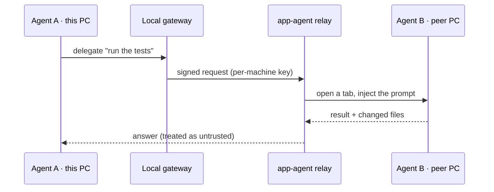

# Jamat — Architecture

Jamat is a **TypeScript monorepo**. Several independent entry points (`app-*`) share one piece of
business logic (`core/`); `core/` spawns Claude Code or Codex as a local subprocess and reaches your
other machines over a token-gated LAN bridge. The whole thing runs on your own keys — nothing is proxied.

## System context

```archify
{
  "schema_version": 1,
  "diagram_type": "architecture",
  "meta": { "title": "app-* → core → agent CLIs, and out to peers", "subtitle": "app-* depend on core/, never the reverse", "viewBox": [820, 390] },
  "components": [
    { "id": "electron", "type": "frontend", "label": "app-electron",              "pos": [40, 30],  "size": [190, 56] },
    { "id": "cli",      "type": "frontend", "label": "app-cli",                   "pos": [40, 98],  "size": [190, 56] },
    { "id": "agent",    "type": "backend",  "label": "app-agent",                 "pos": [40, 166], "size": [190, 56] },
    { "id": "stats",    "type": "database", "label": "app-stats",                 "pos": [40, 234], "size": [190, 56] },
    { "id": "wol",      "type": "backend",  "label": "app-wol",                   "pos": [40, 302], "size": [190, 56] },
    { "id": "core",     "type": "backend",  "label": "core/ — shared logic",      "pos": [320, 120],"size": [190, 150] },
    { "id": "agentCli", "type": "external", "label": "Claude Code / Codex CLI",   "pos": [590, 60], "size": [210, 64] },
    { "id": "peer",     "type": "external", "label": "Peer machine (LAN)",        "pos": [590, 240],"size": [210, 64] }
  ],
  "connections": [
    { "from": "electron", "to": "core",  "label": "import", "variant": "emphasis" },
    { "from": "cli",      "to": "core",  "label": "import", "variant": "emphasis" },
    { "from": "agent",    "to": "core",  "label": "import", "variant": "emphasis" },
    { "from": "stats",    "to": "core",  "label": "reads" },
    { "from": "core",     "to": "agentCli", "label": "spawns" },
    { "from": "core",     "to": "peer",  "label": "LAN bridge", "variant": "security", "labelDy": 10 },
    { "from": "wol",      "to": "peer",  "label": "wake", "variant": "dashed" }
  ]
}
```

## Inside `core/`

`core/` is framework-free and UI-free — no Electron, no HTTP server, no `readline`. Every entry point
imports it; it imports none of them.

```svg
<svg xmlns="http://www.w3.org/2000/svg" viewBox="0 0 720 300" width="720" height="300" font-family="system-ui, sans-serif">
  <rect x="6" y="6" width="708" height="288" rx="16" fill="#0d1117" stroke="#1f6feb" stroke-width="1.5"/>
  <text x="28" y="40" fill="#e6edf3" font-size="15" font-weight="700">core/</text>
  <text x="80" y="40" fill="#8b949e" font-size="12">dependency-free shared logic — zero external deps</text>

  <rect x="28" y="64" width="204" height="60" rx="9" fill="#161b22" stroke="#2d333b"/>
  <text x="44" y="90" fill="#e6edf3" font-size="13" font-weight="700">types/</text>
  <text x="44" y="109" fill="#8b949e" font-size="11">canonical shapes · DTOs · IPC contracts</text>

  <rect x="258" y="64" width="204" height="60" rx="9" fill="#161b22" stroke="#2d333b"/>
  <text x="274" y="90" fill="#e6edf3" font-size="13" font-weight="700">config/</text>
  <text x="274" y="109" fill="#8b949e" font-size="11">load + merge per-user config</text>

  <rect x="488" y="64" width="204" height="60" rx="9" fill="#161b22" stroke="#2d333b"/>
  <text x="504" y="90" fill="#e6edf3" font-size="13" font-weight="700">menu-core/</text>
  <text x="504" y="109" fill="#8b949e" font-size="11">project tree · session state</text>

  <rect x="28" y="138" width="204" height="60" rx="9" fill="#161b22" stroke="#2d333b"/>
  <text x="44" y="164" fill="#e6edf3" font-size="13" font-weight="700">agents/</text>
  <text x="44" y="183" fill="#8b949e" font-size="11">claude · codex adapters</text>

  <rect x="258" y="138" width="204" height="60" rx="9" fill="#161b22" stroke="#2d333b"/>
  <text x="274" y="164" fill="#e6edf3" font-size="13" font-weight="700">executor/</text>
  <text x="274" y="183" fill="#8b949e" font-size="11">runs the menu ↔ agent loop</text>

  <rect x="488" y="138" width="204" height="60" rx="9" fill="#161b22" stroke="#2d333b"/>
  <text x="504" y="164" fill="#e6edf3" font-size="13" font-weight="700">abilities/</text>
  <text x="504" y="183" fill="#8b949e" font-size="11">skills · MCP · plugins scan</text>

  <rect x="28" y="212" width="664" height="60" rx="9" fill="#12203a" stroke="#388bfd"/>
  <text x="44" y="238" fill="#e6edf3" font-size="13" font-weight="700">jamat/</text>
  <text x="44" y="257" fill="#8b949e" font-size="11">the AI bridge — orchestrator, scenarios, remote-control contracts (one agent drives another)</text>
</svg>
```

## Package map

| Folder | Responsibility |
|---|---|
| `core/` | Shared, dependency-free logic — types, config, project engine, agent adapters, the AI bridge. |
| `app-electron/` | Desktop app — Electron **main** (windows, IPC, PTYs) + **renderer** (React · dockview · xterm.js · node-pty). |
| `app-cli/` | Terminal menu (TUI) + a scriptable bridge client (`jamat`). |
| `app-agent/` | Per-machine REST API + a small LAN relay + the mobile launch web app. |
| `app-stats/` | Unified local Claude + Codex usage statistics for the React dashboard. |
| `app-wol/` | Standalone Wake-on-LAN proxy for an always-on device. |
| `dockerized-claude/` | Docker image that runs Claude Code sandboxed (non-root, `--dangerously-skip-permissions`). |
| `skills/` · `scripts/` · `configs/` · `bin/` | Bundled Claude skills · build/test scripts · public config template · cross-platform launchers. |

:::important[The dependency rule — the one that keeps this maintainable]
`app-*` depend on `core/`, **never the reverse**, and **never on each other**. Types are canonical in
`core/`; `core/` takes paths as parameters (never `__dirname`, which breaks in the Electron bundle);
imports are relative (no path aliases, no barrel files).
:::

```ts
// app-electron/src/main/ → core is always a relative import
import { loadConfig } from '../../../core/config'
import type { RemotePeer } from '../../../core/types/remote-control'

// core/ imports NOTHING from app-* — the arrow only points one way.
```

## Reaching another machine — one agent drives another

Remote control and the AI bridge are **off by default** and loopback-only until you opt in. When
enabled, `app-agent` is the token-gated relay; the answer that comes back is treated as **untrusted**.



:::note[Security boundaries, briefly]
The LAN surface is **token-gated per machine**, the operation registry is **closed-by-default**,
remote file access is **path-scoped**, and **every remote action is audit-logged**. Wake-on-LAN can
wake a sleeping peer only when you allow it.
:::

---

*Not affiliated with Anthropic. "Claude" and "Claude Code" are products of Anthropic; Jamat runs them
as your own local subprocesses, on your own keys.*
