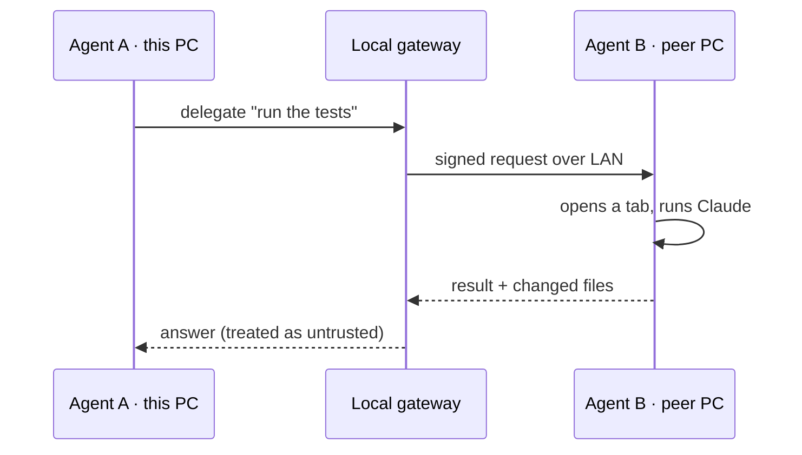

# What Jamat Can Do

**Jamat** — *Just Another Multi-Agent Terminal* — is an open-source desktop control center for
running many [Claude Code](https://www.anthropic.com/claude-code) sessions in one tiling workspace,
reaching the sessions on your other computers, and letting one AI agent operate another's tab.

> This page is itself a demo: you're reading it inside Jamat's **FileViewer**, rendered by the
> `MdExtRenderer` widget — the same viewer that shows any Markdown file you open in a tab.

::status{workspace=stable cross_machine=stable ai_bridge=beta mobile=beta platform="Windows now" agents="Claude Code now"}

---

## Every session in one window

One tiling, dockable workspace over **dockview + xterm.js + node-pty**. Split panes, multiple
windows, multiple tabs — with full **position / size / layout persistence**, plus named & colored
windows so topic groups stay visually distinct.

:::tip[It's not only for code]
Every "project" is just a **folder**, so a topic like *garden*, *taxes*, or *house-renovation* gets
its own persistent, topic-scoped conversation — a filing cabinet of ongoing AI chats, each with its
own history and documents. Drop PDFs or photos in the folder and the agent reads them as context.
:::

## Never lose an agent — live per-tab status

A colored dot on each tab tells you, at a glance and across every window, which agent is **working**,
which is **waiting on you**, and which is **done** — so nothing stalls unnoticed.

```svg
<svg xmlns="http://www.w3.org/2000/svg" viewBox="0 0 560 130" width="560" height="130" font-family="system-ui, sans-serif">
  <rect x="1" y="1" width="558" height="128" rx="14" fill="#0d1117" stroke="#2d333b"/>
  <rect x="24" y="34" width="150" height="62" rx="10" fill="#161b22" stroke="#2d333b"/>
  <circle cx="48" cy="65" r="8" fill="#3b82f6"/>
  <text x="66" y="61" fill="#e6edf3" font-size="13" font-weight="700">backend</text>
  <text x="66" y="80" fill="#8b949e" font-size="11">working…</text>
  <rect x="205" y="34" width="150" height="62" rx="10" fill="#161b22" stroke="#f59e0b"/>
  <circle cx="229" cy="65" r="8" fill="#f59e0b"/>
  <text x="247" y="61" fill="#e6edf3" font-size="13" font-weight="700">admin</text>
  <text x="247" y="80" fill="#8b949e" font-size="11">waiting on you</text>
  <rect x="386" y="34" width="150" height="62" rx="10" fill="#161b22" stroke="#2d333b"/>
  <circle cx="410" cy="65" r="8" fill="#22c55e"/>
  <text x="428" y="61" fill="#e6edf3" font-size="13" font-weight="700">docs</text>
  <text x="428" y="80" fill="#8b949e" font-size="11">done</text>
</svg>
```

## Day-to-day helpers

| Feature | What it does |
|---|---|
| **Quick project & session selector** | A command palette lists your projects and each project's recent sessions — resume the exact session by name or open a new tab, no hunting for `--resume` IDs. |
| **Easy compaction** | When context fills up, a one-click **Compact now** nudge runs `/compact` at thresholds you set (also on the status bar and the tab menu). |
| **Predefined messages** | Reply to a finished agent in one click — "Continue", "Summarize", or your own quick prompts — typed and sent for you. |
| **See exactly what changed** | Diffs **by git/SVN history, by session, or by individual message**; file / changes / directory viewers; session search across all projects. |

:::note[Compaction, precisely]
The nudge fires only when a session crosses a threshold **and** is idle (turn finished, prompt
waiting) — never over an in-progress turn or a permission prompt. Postpone snoozes that level; the
card reappears only once context climbs to the **next** threshold.
:::

## Detailed Claude usage stats

A usage dashboard breaks **cost and tokens** down by project and model — input / output / cache —
across **1h / 5h / 24h** windows.

```vega-lite
{
  "mark": {"type": "bar", "cornerRadiusEnd": 3},
  "data": { "values": [
    {"model": "Opus 4.8",  "cost": 18.4},
    {"model": "Sonnet 5",  "cost": 6.1},
    {"model": "Haiku 4.5", "cost": 0.9}
  ]},
  "encoding": {
    "x": {"field": "model", "type": "nominal", "sort": "-y", "axis": {"labelAngle": 0}, "title": null},
    "y": {"field": "cost", "type": "quantitative", "title": "Cost (USD · last 24h)"},
    "color": {"field": "model", "type": "nominal", "legend": null}
  }
}
```

## Reach across machines — and let AI drive AI

Over your LAN you can take over a session running on another computer, or hand a task to a remote
agent; the remote work shows up in a dedicated, highlighted tab. One agent can even drive **another
agent's tab** — full UI-level control, not just a CLI hook.



:::danger[The remote answer is untrusted]
Anything that comes back over the bridge is treated as **untrusted input** — a peer's agent could be
compromised or confused. Remote control and the AI bridge are **off by default** and loopback-only
until you opt in; the LAN surface is token-gated, the operation registry is closed-by-default, remote
file access is path-scoped, and **every remote action is audit-logged**.
:::

## From your phone

Wake your PC with **Wake-on-LAN** and launch a session from a small web app, then drive it through
Claude Code's own interface. (A native mobile app is on the roadmap.)

## Extensibility & this very viewer

- Discover and toggle Claude **skills, slash-commands, subagents, MCP servers, and plugins** from
  inside the app.
- Rich **Markdown + diagram rendering** — GFM, syntax-highlighted code, and inline diagrams
  (Mermaid, Graphviz, Vega-Lite, Archify) plus hand-authored SVG. *You are looking at it now.*

## Under the hood

Jamat is a TypeScript monorepo: several entry points share one dependency-free `core/`. `app-*`
depend on `core/`, **never the reverse**, and never on each other.

```archify
{
  "schema_version": 1,
  "diagram_type": "architecture",
  "meta": { "title": "app-* → core → Claude, and out to peers", "viewBox": [880, 240] },
  "components": [
    { "id": "apps",   "type": "frontend", "label": "app-electron / app-cli / app-agent", "pos": [40, 90],  "size": [230, 70] },
    { "id": "core",   "type": "backend",  "label": "core/ — shared logic",               "pos": [330, 90], "size": [180, 70] },
    { "id": "claude", "type": "external", "label": "Claude Code subprocess",              "pos": [570, 30], "size": [270, 60] },
    { "id": "peer",   "type": "external", "label": "Peer machine over LAN",               "pos": [570, 150],"size": [270, 60] }
  ],
  "connections": [
    { "from": "apps", "to": "core",   "label": "import", "variant": "emphasis" },
    { "from": "core", "to": "claude", "label": "spawn" },
    { "from": "core", "to": "peer",   "label": "bridge", "variant": "security" }
  ]
}
```

Run any surface from the `bin/` launchers, or directly:

```bash
# Desktop app (first launch opens a guided Settings wizard — no JSON to edit)
bin\start.bat                    # or bin\start-dev.bat for the electron-vite dev server

# Terminal menu, or the mobile-remote agent server
node --import tsx app-cli/executor.ts --config configs/config.json
node --import tsx app-agent/agent-server.ts --config-dir ~/.jamat
```

A per-user config points Jamat at your own folders — copied once from the public template:

```json
{
  "categories": [
    { "name": "Work",     "paths": ["C:/Projects/backend", "C:/Projects/web"] },
    { "name": "Personal", "paths": ["C:/Life/garden", "C:/Life/taxes"] }
  ],
  "defaultAgent": "claude"
}
```

## Capability checklist

- [x] Tiling, dockable, persistent multi-window / multi-tab workspace
- [x] Live per-tab working / waiting-on-you / done detection
- [x] Quick project & session selector (command palette)
- [x] One-click compaction nudge at configurable thresholds
- [x] Predefined quick-reply messages
- [x] Detailed per-project / per-model usage & cost stats
- [x] Diffs by git/SVN, by session, or by message
- [x] Cross-machine LAN control + AI-drives-AI bridge
- [x] Phone launch via Wake-on-LAN + web app
- [x] Skill / slash-command / subagent / MCP / plugin management
- [x] Rich Markdown + diagram rendering (this document)
- [ ] macOS & Linux builds *(soon)*
- [ ] More agents — Codex / GPT via the adapter layer *(soon)*
- [ ] Native mobile app *(soon)*

:::details[Architecture rules (why the layout is the way it is)]
- `core/` has **no UI or framework deps** — no readline, no Electron, no HTTP server code.
- `app-*` depend on `core/`, **never the reverse**; and never on another `app-*`.
- Types are **canonical in `core/types.ts`** — no duplicate definitions in `app-*`.
- `core/` modules accept paths as **parameters** — never `__dirname` (breaks in the Electron bundle).
- All imports are **relative** — no path aliases, no barrel files.
:::

---

*Not affiliated with Anthropic. "Claude" and "Claude Code" are products of Anthropic; Jamat runs them
as your own local subprocesses, on your own keys.*
