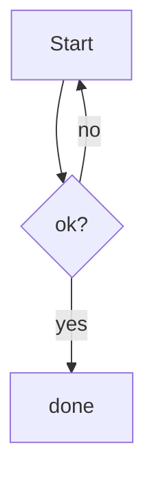

# mdext-renderer — the format the app's markdown viewer renders

`MdExtRenderer` is a deterministic, **render-only** Markdown viewer. You (the LLM) produce only the
*format* (plain-text Markdown); the widget renders it. Everything here is **valid Markdown** — open
the same file in GitHub or a plain editor and it degrades gracefully to source / fenced blocks. The
`.mdext` extension is just a signal "uses the extensions"; a `.md` file is rendered identically.

## What renders

| You write | The viewer shows |
|---|---|
| GitHub-Flavored Markdown (headings, **bold**, lists, tables, task lists, blockquotes, `inline code`) | Styled, themed (light/dark via the host) |
| A fenced code block with a language tag — ` ```ts `, ` ```python `, ` ```bash `, … | **Syntax-highlighted** code (Shiki) with a hover **Copy** button |
| A fenced code block with **no** language | A plain (unhighlighted) code block — still a block, not inline |
| Leading YAML frontmatter (`---` … `---`) | A compact **collapsible metadata strip** (not body text) |
| Links / images | Rendered, but only safe URLs (`http(s)`, `#anchor`, relative). `javascript:`/`data:`/`file:` dropped |
| Diagram / chart fences (see below) | Inline, sanitized, theme-reactive SVG |
| Typed blocks (`:::warning`, `::status`, `:::details`) | Callout boxes / status pills / collapsibles |

## What is inert / stripped (security — always on)

- **Raw HTML is not rendered.** `<script>`, ``, any embedded HTML → shown as text or
  dropped, never executed. Do **not** inject HTML for layout; use Markdown / typed blocks / diagrams.
- **Unsafe URLs are neutralized** (`javascript:`, `data:`, `file:`, protocol-relative `//host`).
- **Remote/peer files** render in a stricter tier (external `http(s)`/`file:` resources blocked).

The renderer treats all content as untrusted by design — you cannot "escape" into code execution, so
HTML tricks silently do not render. The same is true of every diagram engine: each emits a static
SVG that is sanitized (no scripts, no foreign objects) before it is shown.

## Diagrams & charts — pick the right engine

All fences render to inline, sanitized SVG, 100% offline. **Hand-authored ` ```svg ` is the default
for bespoke visuals** — charts, reports, illustrations, anything custom: you draw the SVG directly,
full control, best-looking. Reach for a **typed engine** only when you want determinism, cheap tokens
on a big dataset, or automatic light/dark.

| Your job | Use | Fence | Notes |
|---|---|---|---|
| Bespoke chart / report / illustration / **anything custom** | **Hand-SVG** | ` ```svg ` | you draw it — see [svg-style.md](./svg-style.md) |
| System / component architecture, boundaries (VPC, security group) | **Archify** `architecture` | ` ```archify ` | deterministic + themed |
| Interaction / messages over time | **Archify** `sequence` | ` ```archify ` | |
| Multi-actor process across swimlanes | **Archify** `workflow` | ` ```archify ` | |
| Data pipeline / movement, PII / classification | **Archify** `dataflow` | ` ```archify ` | |
| State machine / lifecycle | **Archify** `lifecycle` | ` ```archify ` | |
| Quantitative data — **big or repeatable** | **Vega-Lite** | ` ```vega-lite ` | compact data, auto-theme |
| Custom graph layout / a Graphviz feature | **Graphviz** | ` ```dot ` | |
| Quick auto-laid-out flow / graph | **Mermaid** | ` ```mermaid ` | |

**Honest trade-offs.** Hand-SVG (` ```svg `) is the most flexible and best-looking, but it is **not
deterministic** (you place every coordinate) and **token-heavy for big datasets**; inline colors bake
one theme (use CSS classes → `--mdext-*` if it must follow light/dark). Archify is deterministic +
themed but *explicit-layout* — it **throws** on overlap/off-canvas (→ error + show source). Vega-Lite
is cheapest for data (you emit compact data, not coordinates) and auto-themes. Mermaid auto-lays-out
for quick flows. A render error in any engine falls back to a readable "show source"; sources over
50 KB show source instead of running the engine.

### Hand-authored SVG (` ```svg `)

Put an `<svg>` element straight into a ` ```svg ` fence; it is sanitized (`sanitizeSvg` — `script`,
`on*`, `foreignObject`, `use`, `image`, external URLs stripped) and injected inline. **Same safety
class as engine output — this is NOT the raw-HTML hatch; P1-002 stays closed.** Content that isn't an
`<svg>` shows an error + source. Full style + chart recipes (bars / line+area / donut, scale mapping,
the sanitize-safe element set): [svg-style.md](./svg-style.md).

````
```svg
<svg xmlns="http://www.w3.org/2000/svg" viewBox="0 0 240 80" width="240" height="80" font-family="system-ui">
  <rect x="1" y="1" width="238" height="78" rx="12" fill="#0d1117" stroke="#2d333b"/>
  <text x="20" y="34" fill="#e6edf3" font-size="13" font-weight="700">Uptime</text>
  <text x="20" y="62" fill="#4ade80" font-size="22" font-weight="700" font-family="ui-monospace,monospace">99.98%</text>
</svg>
```
````

### Mermaid / Graphviz / Vega-Lite

````

````

**Data charts** — a ` ```vega-lite ` fence holds a [Vega-Lite](https://vega.github.io/vega-lite/) JSON
spec (bar / line / scatter / area / heatmap …). For real data-driven charts; Mermaid is for
flow/structure. **Data must be inline** (`"data": { "values": [...] }`) — remote/`file:` `data.url`s
and image marks are blocked (offline + no-exfil), so a spec that fetches a URL renders an error.

````
```vega-lite
{ "mark": "bar",
  "data": { "values": [{"q":"Q1","rev":42},{"q":"Q2","rev":58},{"q":"Q3","rev":51}] },
  "encoding": { "x": {"field":"q","type":"nominal"}, "y": {"field":"rev","type":"quantitative"} } }
```
````

### Archify — typed architecture-family diagrams

A ` ```archify ` fence holds an [archify](https://github.com/tt-a1i/archify) JSON spec. One required
field, `diagram_type`, selects one of five renderers: `architecture`, `workflow`, `sequence`,
`dataflow`, `lifecycle`. Common shape: every spec has `schema_version: 1`, `diagram_type`, a `meta`
(`title`, optional `subtitle`, optional `viewBox: [w, h]`), then the per-type body.

Nodes/components/participants/states carry a **semantic `type`** that colors them consistently:
`external`, `frontend`, `backend`, `database`, `cloud`, `security`, `messagebus`. Connections carry a
**`variant`**: `default`, `emphasis`, `security`, `dashed` (and `return` for sequence replies).

Minimal `architecture` example:

````
```archify
{
  "schema_version": 1,
  "diagram_type": "architecture",
  "meta": { "title": "3-tier web app" },
  "components": [
    { "id": "web",  "type": "frontend", "label": "Web",  "pos": [40, 60],  "size": [120, 60] },
    { "id": "api",  "type": "backend",  "label": "API",  "pos": [260, 60], "size": [120, 60] },
    { "id": "db",   "type": "database", "label": "DB",   "pos": [480, 60], "size": [120, 60] }
  ],
  "connections": [
    { "from": "web", "to": "api", "label": "HTTPS", "variant": "emphasis" },
    { "from": "api", "to": "db",  "label": "SQL" }
  ]
}
```
````

The other four types and their exact fields are in [reference.md](./reference.md); full worked specs
for all five are in [examples/archify-showcase.mdext](./examples/archify-showcase.mdext).

## Typed blocks

Three block types extend Markdown with structure it can't express natively. They use
[remark-directive](https://github.com/remarkjs/remark-directive) syntax and still degrade to readable
source in a plain viewer.

**Callouts** — colored boxes. Types: `note`, `tip`, `warning`, `danger`, `important`. Body is full
Markdown; an optional `[Title]` overrides the default heading.

```
:::warning[Heads up]
Body is **markdown** — lists, `code`, [links](https://example.com) all work.
:::
```

**Status chips** — one `::status` line → a row of pills, colored by value (`passing`/`done`/`ok` →
green; `pending`/`partial`/`medium` → amber; `fail`/`high`/`blocked` → red; anything else → neutral).
Quote values containing spaces or `%`.

```
::status{build=passing coverage="82%" risk=high}
```

**Collapsible** — `:::details[Title]` hides long optional content (alternatives, raw logs) behind a
click.

```
:::details[Alternatives considered]
Long content here.
:::
```

An **unrecognized** directive name renders its content as a plain block (no styling, no error) — so
authoring an unknown block never breaks the view.

## How to author for it

1. Write normal GFM. Prefer the typed structure (headings, tables, task lists) over hand-formatted text.
2. **Always tag code fences with a language** so they highlight — ` ```ts ` not ` ``` `.
3. Put document metadata in YAML frontmatter (title, status, date, …) — it becomes the collapsible strip.
4. For a visual, **pick from the table above** — hand-author a ` ```svg ` for bespoke charts / reports /
   illustrations (default); use a typed engine (Archify / Vega-Lite / Mermaid) for deterministic,
   data-heavy, or auto-themed cases. Keep SVG inside the sanitize-safe set (no `<foreignObject>`/scripts);
   for Archify, place nodes deliberately (no overlaps / off-canvas).
5. Use **callouts** (`:::warning` …) for asides/constraints, **`::status{…}`** for status/metrics,
   **`:::details[…]`** for long optional content — instead of hand-formatting them.
6. Never embed raw HTML — it won't render.

## Self-check before emitting

- Every multi-line code sample is in a fenced block **with a language tag**.
- Each visual uses the right tool (hand-SVG for bespoke; a typed engine for data-heavy/deterministic).
- A ` ```svg ` fence holds a valid `<svg>` that fits its `viewBox` and stays in the sanitize-safe set.
- Archify specs are valid JSON, set `diagram_type`, and place nodes without overlaps / off-canvas.
- No raw HTML used for layout (use Markdown / tables / typed blocks).
- Metadata is in frontmatter, not a hand-drawn table at the top.
- Links/images use `http(s)` / relative URLs only.

See [reference.md](./reference.md) for supported languages, theming, every Archify type's fields, the
full typed-block reference, and graceful degradation. Examples in [examples/](./examples/).
